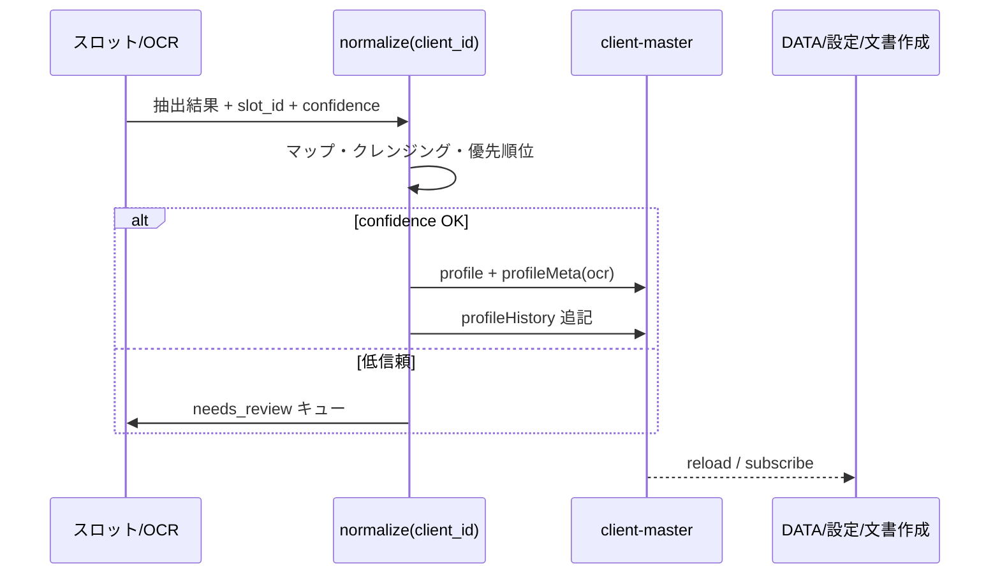

# 顧客データ（DATA）— 正規化ハブ設計

最終更新: 2026-06-17

## 目的

「データ」画面（サイドバー **DATA** / `period_key = data`）は、顧問先に関する情報の **入力フォーム** ではなく、  
あらゆるソースから入ってきた情報を **正規化して一元化し、プロダクト全体へ自動反映するハブ** として設計する。

税理士・担当者の通常操作は **資料の投入と例外対応** に留め、  
フィールドの再入力や画面間の手動コピーは原則発生させない。

---

## 北極星（ユーザー体験）

| 操作 | 期待 |
|------|------|
| 定款・謄本・申告書をスロットに上げる / OCR | 法人名・資本金・法人番号などが **自動でマスタに反映** |
| 「データ」を開く | **すでに最新** の正規化一覧が見える（出所: OCR / 手動 / マスタ 等） |
| 「設定」の顧客詳細を開く | データ画面と **同じ値** |
| 文書作成（役員報酬議事録など） | テンプレ変数が **同じ正規化ストア** から埋まる |
| 進捗・税務アラート・納税カレンダー | 正規化データと資料充足から **派生**（再入力不要） |
| 人が値を直す | **例外**。変更履歴に誰が・いつ・何から何へを残す |

---

## 現状（2026-06-17）

### できていること

| 領域 | 内容 |
|------|------|
| **DATA ワークスペース** | 会社グリッド（NavBar）直下の第2グリッドでタブ切替 |
| **タブ構成** | マスタ / グラフ（ダッシュボード）/ 進捗 / 自社株評価 / コミュニケーション / 調査事項 / 特殊事項 |
| **正規化一覧** | `client-master.profile` の許可フィールド + マスタ行（顧問先名・決算月等） |
| **出所表示** | `profileMeta`（`manual` / `ocr` / `master` / `import`） |
| **変更履歴** | `profileHistory`（更新者・日時・変更前後） |
| **手動編集** | マスタタブで「変更 → 保存」。設定画面の一括保存と **API 同期** |
| **関連資料** | フィールド → 定款・謄本等スロットへのクイックオープン（`client-field-sources.ts`） |
| **派生 UI（試算）** | ダッシュボード・進捗・納税カレンダー・自社株評価は profile / `document-status` を参照 |

### まだ弱いところ（ギャップ）

| 領域 | ギャップ |
|------|----------|
| **自動取り込み** | スロット保存 → `ssot_ingest.ingest_from_slot_document` → `profile_normalize_pipeline`（D1 実装済み） |
| **正規化ルール** | ソース優先順位・手動保護・矛盾時 tax_alert — **v1 実装済み**（表記ゆれは部分） |
| **全画面自動反映** | 保存後 `SSOT_PROPAGATE_EVENT` + `ORG_DIRECTORY_RELOAD`（フロント） |
| **外部連携** | Slack / Gmail はデモ UI のみ |
| **構造化抽出** | 申告書からの課税売上等の `metadata_json` は未保存（`document-catalog-vision.md` 参照） |

---

## 画面構成（DATA ワークスペース）

```
NavBar（顧問先グリッド）
  └─ DataContextGrid（第2グリッド・横ドラム）
       ├─ マスタ      … 正規化フィールドの一覧・例外修正・履歴
       ├─ グラフ      … ダッシュボード（売上・利益等の派生表示）
       ├─ 進捗        … 申告サイクル・税務アラート・納税カレンダー
       ├─ 自社株評価  … 非上場株式評価試算（法人向け）
       ├─ コミュニケーション … チャット・メール履歴（連携予定）
       ├─ 調査事項    … `tax_audit_history` 等と同期
       └─ 特殊事項    … `handling_notes` / `remarks` 等と同期
```

**原則:** マスタ以外のタブは **正規化ストアの読み取り専用ビュー**（計算・集計・試算）とし、  
二次入力フォームにしない。

---

## 三層アーキテクチャ

**横断原則:** 全ドメインの SSOT レジストリとデータフローは [`ssot-normalization.md`](ssot-normalization.md) を参照。

### 1. 取り込み（Ingest）

| ソース | 例 | 将来のフック |
|--------|-----|----------------|
| 資料 OCR | 定款・謄本・申告書 | スロット POST / OCR 完了 Webhook |
| マトリクス | スロット確定・版更新 | `classify_metadata` / `metadata_json` |
| 手動 | 設定・DATA マスタタブ | `PUT /api/client-master` |
| 外部 | Slack / Gmail | 連携コネクタ |
| 派生計算 | 決算月 → 納税カレンダー | ルールエンジン（保存不要の表示のみも可） |

### 2. 正規化（Normalize）

```
生データ → フィールド ID マッピング → クレンジング → 優先順位マージ → client-master
```

| 処理 | 説明 |
|------|------|
| **マッピング** | 抽出キーを `CLIENT_PROFILE_FIELD_IDS` に対応（`client_profile_fields.py`） |
| **クレンジング** | 全角半角・会社形態・住所表記の統一 |
| **優先順位** | 例: 謄本の法人番号 ＞ 手入力 ＞ 古い OCR 版 |
| **メタ** | `profileMeta`: `source`, `sourceSlotId`, `sourcePeriodKey`, `sourceDocumentLabel`, `updatedAt`, `updatedBy` |
| **履歴** | `profileHistory`: 変更の追記専用ログ |
| **矛盾** | ソース間不一致 → **進捗タブの税務アラート** に昇格 |

信頼度が閾値未満の OCR は **フィールドを更新せず** `needs_review`（要確認キュー）に留める方針は `docs/backlog-2026-06-02.md` §3 と同じ。

### 3. 反映（Propagate）

正規化結果の **単一の正** は `GET/PUT /api/client-master` の各 `client` オブジェクト。

購読者（自動で同じデータを読む）:

| 購読者 | 用途 |
|--------|------|
| DATA 各タブ | 一覧・ダッシュボード・進捗・株価試算 |
| 設定 › 顧客詳細 | 編集 UI（保存時も同じストアへ） |
| `useOrgDirectory` | メインページの顧問先名・決算月 |
| 文書作成テンプレ | `template_variable_parser` / profile エイリアス |
| `document-status` | 充足率・アラート（資料側） |
| 将来: カタログ横断一覧 | `document-catalog-vision.md` |

同期メカニズム（現行）: 保存後に `ORG_DIRECTORY_RELOAD_EVENT` でフロント再取得。  
目標: バックエンドで `normalize(client_id)` 完了後に **1 回の保存 + 通知** で全購読者を更新。

---

## データモデル（client-master）

### 顧問先 1 件の関連フィールド

```typescript
// 概念型（実装: backend ClientMasterClient / frontend OrgClient）
{
  id: string;
  name: string;           // マスタ行。履歴キー _name
  fiscalMonth: number;    // 履歴キー _fiscal_month
  category: "corporate" | "individual";
  tags?: string[];
  profile: Record<string, string>;              // 正規化済み値
  profileMeta: Record<string, ProfileFieldMeta>; // フィールドごとの出所
  profileHistory: Record<string, ProfileFieldChange[]>; // 変更履歴
}
```

### フィールド定義の単一ソース

| 層 | ファイル |
|----|----------|
| 許可 ID（バックエンド） | `backend/services/client_profile_fields.py` |
| UI セクション定義 | `frontend/src/config/client-profile-fields.ts` |
| 関連資料マップ | `frontend/src/config/client-field-sources.ts` |

新フィールド追加時は **上記3か所 + サニタイズ** を同時に更新する。

### 手動編集の位置づけ

- DATA マスタタブ: 「変更 → 保存」で `source: manual` を記録
- 設定: 一括保存時に差分を `profileHistory` に追記（`mergeClientHistoryOnSave`）
- 自動取り込みと競合した場合は **優先順位ルール** で解決（将来）。手動は高優先度にするかは product 判断としてルール表に明記する。

---

## ソース優先順位（案・未実装）

| 優先度 | ソース | 典型 |
|--------|--------|------|
| 1 | 手動（明示保存） | 担当者が DATA / 設定で確定 |
| 2 | 永続スロット OCR（高信頼） | 謄本・定款の構造化抽出 |
| 3 | 決算期スロット OCR | 法人税申告書 |
| 4 | インポート | CSV / 他システム |
| 5 | デフォルト / 推論 | 試算のみ、profile には書かない |

同一フィールドに複数ソースがある場合、上位が採用され、下位は `profileMeta` または監査ログに **候補として残す** 案。

---

## パイプライン（目標シーケンス）



エントリポイント候補:

- `POST /api/slots` 成功後（バックエンド）
- OCR ワーカー完了時
- `PUT /api/client-master`（手動・設定）

---

## 実装フェーズ（推奨順）

| 段階 | 内容 | 関連ドキュメント |
|------|------|------------------|
| **D0** | 現行 UI・profileMeta・profileHistory・設定同期 | 本書「現状」 |
| **D1** | スロット保存 → 薄い OCR メタ → 限定フィールド自動反映（法人名・法人番号等） | `backlog-2026-06-02.md` §3 |
| **D2** | 優先順位・矛盾アラート・要確認キューとの統合 | `roadmap.md` P3–P4 |
| **D3** | 申告書 `metadata_json` → ダッシュボード数値の自動更新 | `document-catalog-vision.md` |
| **D4** | Slack / Gmail → コミュニケーションタブ | 本書 §画面構成 |
| **D5** | 自社株評価の正式計算（評価通達準拠） | 国税庁評価通達 |

---

## コード参照（現行実装）

| 領域 | パス |
|------|------|
| DATA ワークスペース | `frontend/src/features/client-data/DataWorkspace.tsx` |
| 第2グリッド | `frontend/src/features/client-data/DataContextGrid.tsx` |
| タブ定義 | `frontend/src/features/client-data/data-workspace-tabs.ts` |
| マスタ一覧・編集 | `frontend/src/features/client-data/ClientDataOverview.tsx` |
| 保存・履歴 | `frontend/src/lib/client-field-mutations.ts`, `client-master-api.ts` |
| API | `GET/PUT /api/client-master`（`docs/api-contract.md`） |
| バックエンドサニタイズ | `backend/services/client_profile_fields.py`, `main.py` |

---

## 関連ドキュメント

| ファイル | 関係 |
|----------|------|
| [`taxx-ecosystem-development-plan.md`](taxx-ecosystem-development-plan.md) | エコシステム全体ビジョン・Phase 1–4 |
| [`roadmap.md`](roadmap.md) | 現行リポジトリ P0–P5 |
| [`backlog-2026-06-02.md`](backlog-2026-06-02.md) | OCR 正規化スコープ、`ExtractedDocumentMeta` |
| [`document-catalog-vision.md`](document-catalog-vision.md) | 申告書数値の横断・ソート |
| [`docugrid-matrix-model.md`](docugrid-matrix-model.md) | セル座標・マトリクス思想 |
| [`api-contract.md`](api-contract.md) | `client-master` HTTP 契約 |
| [`architecture.md`](architecture.md) | ランタイム全体 |

---

## 変更履歴

| 日付 | 内容 |
|------|------|
| 2026-06-17 | 初版: DATA 正規化ハブの北極星、三層モデル、現状ギャップ、タブ役割、データモデル、実装フェーズ |
