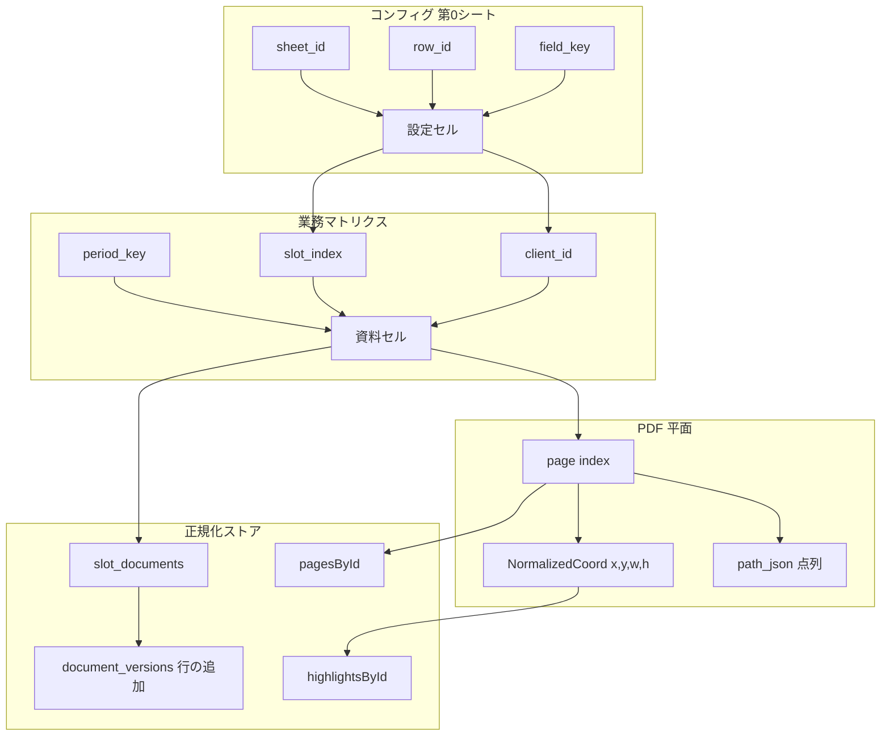

# DocuGrid 基本思想 — マトリクスとセル座標

最終更新: 2026-06-02（コンフィグ画面の方針を追記）

この文書は DocuGrid の **プロダクト・データモデル共通の設計思想** です。  
画面のトンマナは **メインページ（資料の格納マトリクス）** を基準にし、**コンフィグ（設定）画面まで含めて** ビューア・API・永続化のすべてに「縦横の格子」と「セル／座標」の感覚を貫きます。

> **コンフィグまでマトリクスに揃えることは「おまけ」ではない。**  
> 資料の格納も顧客マスタも同じ Excel 的な世界観だと、操作の一貫性と **遊び心**（「このアプリ、どこまでも表だ」）が生まれる。設定だけ別 UI にすると世界観が切れるので、**特に大事にする**。

関連: `docs/roadmap.md`、`docs/architecture.md`、`docs/auth-tenancy-design.md`

---

## 1. ひとことで

**DocuGrid は「税務資料の Excel」である。**

- 表には **行・列** がある（期間 × 資料枠、ページ × ファイル、など）。
- 各マスは **セル** — 空欄・収納済み・要確認など状態を持つ。
- 中身（PDF・注釈・メタデータ）はセルに紐づき、**座標** で参照・監査・API 契約する。
- UI はメインページのように **カードの格子** で見せ、裏側は常に正規化された表構造。

---

## 2. メインページ = 第 1 マトリクス（資料の格納）

ユーザーが最初に触れる **基本ページ** は、次の 2 軸のマトリクスです。

| 軸 | 意味 | 例 |
|----|------|-----|
| **列（横）** | 資料スロット（書類の種類・枠） | 決算報告書、法人税申告書、通帳コピー… |
| **行（縦）** | 期間（サイドバーで選択） | 永続 / 決算期 / 月次 |

```
              [ 枠0 ]  [ 枠1 ]  [ 枠2 ]  [ 枠3 ]  [ 自動振分 ]
期間: year:2    セル     セル     セル     セル      —
```

### セルの状態（マトリクス UI）

| 状態 | 見た目（メインページ準拠） |
|------|---------------------------|
| 空き | 破線枠・「PDF_ここにドロップ」 |
| 収納済み | 白カード・左青ライン・バッジ（収納済み / 版 / ワークフロー） |
| 要確認 | インディゴ系バナー・自動振り分けキュー |
| 編集モード | 枠がプルプル（並べ替え・名前変更） |

**セルアドレス（業務）**

```text
{client_id}:{period_key}:{slot_index}
```

例: `c1:year:2:0` → 顧問先 c1、決算期 year:2、左端の枠。

将来 `firm_id` を先頭に付与（`docs/auth-tenancy-design.md`）。

---

## 3. 内部構造も「表」— Excel 的フラット正規化

フロントの `docugrid-store` は **RDB / スプレッドシートと同型** のフラット構造です（`normalized-state.ts`）。

| シート相当 | ストア | 行の意味 |
|------------|--------|----------|
| Files | `filesById` | 1 PDF ファイル |
| Pages | `pagesById` | 1 ページ（どのファイルの何ページ目か） |
| Highlights | `highlightsById` | 1 注釈 |
| 並び | `pageOrder` | ページ列の **行順**（結合後の線形序） |

**原則**

- 配列のネストで木を作らない。ID で引く **辞書 + 順序配列**。
- 表示は `pageOrder` を走査してセルを並べる（列の並べ替え = 配列の入れ替え）。
- 永続化 `OrderPayload` も同じ形で API に送る（`orderedPages`, `highlightsByPage`）。

これは Excel で言うと:

- シート「Pages」に行番号  
- シート「Highlights」に矩形座標  
- 「表示順」列が `pageOrder`

---

## 4. 座標系の種類（すべて 0-based・正規化を基本）

DocuGrid では **画面・PDF・業務** で座標のスケールが違うが、概念は同じ「セル／矩形」です。

### 4.1 業務マトリクス座標

| 座標 | 型 | 用途 |
|------|-----|------|
| `period_key` | string | `perm` / `year:N` / `month:N` |
| `slot_index` | int | 0..n-1 の枠番号 |
| `client_id` | string | 顧問先（firm 内） |

### 4.2 PDF ページ平面座標（注釈・ハイライト）

**0..1 に正規化** した矩形（`NormalizedCoord`）。バックエンド `/api/highlight` と一致。

```ts
{ x, y, w, h }  // 左上 + 幅高さ（ページ幅・高さに対する比率）
```

フリーハンド蛍光ペン・消しゴムは **点列 `path_json`**（各点も 0..1）。  
＝ ページ上の「セル範囲をなぞった軌道」。

### 4.3 監査リンク座標

2 画面照合では **左右 × ページ × (x, y)**。

```text
side: left | right
page: 0-based ページ index
x, y: 0..1（クリック位置）
```

リンク番号は **時系列の行番号**（Excel の連番列）。

### 4.4 ページ並べ替えマトリクス（ビューア内）

編集モードのサムネグリッドは **スロット列**（各サムネ = 1 ページセル）。

- ドラッグ = 行（列）の入れ替え  
- `pageOrder` が真実  

---

## 5. コンフィグ画面 — 設定も「第 0 シート」のマトリクス（**重要**）

`/settings`（コンフィグまとめ）は、業務マトリクスの **裏側のワークブック** です。  
一般の SaaS の「設定フォーム」ではなく、**メインページと同じ Excel 感** で触れることがプロダクトの個性になります。

### 5.1 なぜコンフィグまで格子にするか

| 効果 | 説明 |
|------|------|
| **世界観の一貫** | ホームも設定も「セルを触っている」感覚が同じ |
| **遊び心** | シート名（CLIENTS / ROLES…）、行番号、セル単位の保存が「表遊び」になる |
| **実装の一貫** | マスタも `Record<id, Entity>` + 列定義。メインの `normalized-state` と同型 |
| **将来の firm 設定** | 事務所ごとの列（`firm_settings`）も「設定シートの列追加」で説明できる |

### 5.2 コンフィグの 3 軸（現行 UI との対応）

```
[ 縦: シート ]     左ドラム（CATEGORIES）     clients | stakeholders | roles | …
[ 横: 列 ]         各シートのフィールド定義   名前 | 決算月 | ロール | ocrTarget | …
[ 深: 行 ]         1 レコード = 1 行セル      顧問先カード / 担当カード / 監査の 1 行
```

| シート（`ConfigCategoryId`） | 行（レコード） | 列（属性セル） | メインページとの関係 |
|------------------------------|----------------|----------------|----------------------|
| `clients` | 顧問先 1 社 | 名称・決算月・関係グループ | 行 = `client_id`、資料マトリクスの行ラベル |
| `stakeholders` | 担当 1 名 | 種別・ロール・**顧問先スコープ** | スコープ = 「担当 × 顧問先」の 0/1 マトリクス（割当表） |
| `roles` | ロール 1 件 | 権限チェック列 | 列 = `AppPermission` |
| `documents` | 書類カテゴリ 1 件 | `ocrTarget` 等フラグ列 | 列 = メインの **資料枠（slot）** の定義元 |
| `integrations` | 連携項目 1 件 | 有効/モデル/キー設定済み | セル状態: 空・設定済み・エラー |
| `audit` | 操作 1 件 | 日時・担当・顧問先・path・結果 | **監査ログ = 追記のみのシート**（フィルタ = 表の絞り込み） |

**設定セルアドレス（将来 API・監査用）**

```text
config:{sheet_id}:{row_id}:{field_key}
```

例: `config:clients:c1:fiscalMonth` → 顧問先 c1 の決算月セル。

### 5.3 UI 方針 — メインページのトンマナをそのまま持ち込む

コンフィグは **別デザインの管理画面にしない**。

| 要素 | コンフィグでの置き方 |
|------|---------------------|
| 背景・カード | `bg-slate-100` + 白カード `rounded-2xl`（顧客マスタのカード格子はメインの資料枠と同族） |
| ナビ | 左ドラム = **シートタブの縦スクロール**（`CONFIG` / `CLIENTS` ラベルはシート名） |
| 見出し | 「顧客マスタ / 関係グループ」— メインと同じ `text-lg font-bold` + `text-xs` 補足 |
| 操作 | セル単位の input / toggle。保存は **シート単位または行単位**（「表のこの範囲を確定」） |
| 監査・履歴 | **表形式を正**とする（行ホバー、列フィルタ、mono の ID・時刻） |

**伸ばしたい表現（遊び心・未達を含む）**

- 担当スコープを **担当 × 顧問先のチェック表** として見せる（カード内トグルでも、列ヘッダ付きグリッドでも可）。
- 書類カテゴリは **列見出し付きの 1 行テーブル**（Excel のヘッダ行）。
- 可能ならセルフォーカス時に **座標風ラベル**（例: `clients!c1.fiscalMonth`）をツールチップで表示 — 業務用でなく「同じ世界」感のため。
- 新しい設定項目は **常に「どのシートのどの列か」** を先に決めてから UI を足す。

**避けるもの（コンフィグ特有）**

- ウィザードだけ・タブだけで表が見えない設定 UI  
- メインと無関係なダーク管理画面のみの美学（ドラムの `slate-900` はシートレールであり、**中身はメインと同じ明るい表**）  
- キー・バリューのみの JSON エディタ風（開発者向けに見える）

### 5.4 実装の参照

| 項目 | パス |
|------|------|
| コンフィグ画面 | `frontend/src/app/settings/page.tsx` |
| シート定義 | 同ファイル `CATEGORIES` / `ConfigCategoryId` |
| 組織マスタ（列の意味） | `frontend/src/config/organization.ts` |
| サーバー設定 API | `GET/PUT /api/system-config`（`docs/api-contract.md`） |

### 5.5 実装状況（段階的移行）

| シート | 状態 | コード |
|--------|------|--------|
| `stakeholders` | **担当 × 顧問先マトリクス**（1/· トグル、セル座標ホバー） | `StakeholderScopeMatrix.tsx` |
| `roles` | **ロール × 権限マトリクス**（読取） | `RolePermissionMatrix.tsx` |
| `documents` | **カテゴリ × フラグ列** + OCR 全体行 | `DocumentCategoryMatrix.tsx` |
| `clients` | カード格子 + 左青ライン + `config:…` ホバー | `ConfigMatrixCard` |
| `audit` | 表形式（既存） | `settings/page.tsx` |
| `integrations` | カード中心（次: 行列表） | 未着手 |
| `dev.*` | **開発用コンフィグ**（platform のみ） | 計画 — [`no-code-config-vision.md`](../no-code-config-vision.md) |
| 共通 | セルアドレス・表シェル | `cell-address.ts`, `ConfigMatrixTable.tsx` |

パス: `frontend/src/features/config/`

---

## 6. UI トンマナ — メインページ基準（コンフィグ含む）

新機能・モーダル・**コンフィグの各シート**も、次を踏襲する。

| 要素 | ガイド |
|------|--------|
| 背景 | `bg-slate-100`、カードは白 |
| 強調色 | `brand` / `blue-600`（進捗・収納済み左ライン） |
| 資料枠 | 角丸 `rounded-xl`、高さ揃え（`15.5rem` グリッド） |
| セクション見出し | 「資料の格納」「ステータス・タスク」— 短い日本語 + `text-sm font-bold` |
| 補足 | `text-xs text-slate-500`、操作ヒントは一文 |
| タスク・警告 | `indigo` / `amber` / `rose` の淡い背景 + 枠線（派手にしすぎない） |
| 数字 | 進捗％は `font-black`、版ラベルは `font-mono` 小さめ |

**避けるもの**

- マトリクスと無関係なフルスクリーン装飾のみの画面  
- 座標や枠の概念が見えないリスト UI への寄せ（どうしても必要なら「表に戻す」導線を付ける）  
- **コンフィグだけ** 別系統のフォーム UI に戻すこと（§5 参照）

---

## 7. 機能ごとのマトリクス対応

| 機能 | ユーザーに見える格子 | 内部の真実 |
|------|---------------------|------------|
| メインページ | 期間 × 資料枠 | `slot_documents` + `slot_key` |
| PDF ビューア | 1 ページ = 1 セル | `PageEntity` + レンダリング |
| 注釈 | ページ上の矩形／ストローク | `HighlightEntity` / `path_json` |
| 監査 2 画面 | 左列・右列 × ページ | `audit_links` + マーカー番号 |
| 自動振り分け | 要確認キュー（行リスト） | 推定 `slot_index` → セルへ確定 |
| Docugrid 同期 | （裏方） | `OrderPayload` = 表のスナップショット |
| **コンフィグ** | シート × 行カード × 列フィールド | `config:{sheet}:{row}:{field}` + 各マスタ API |

---

## 8. API・永続化のルール

1. **クライアントが送るのは「セルアドレス + ペイロード」**  
   例: `client_id`, `period_key`, `slot_id`, `page`, `x,y,w,h`

2. **サーバーはセルが存在するか・権限があるかを検証してから書き込む**  
   （将来は `firm_id` 含む。`auth-tenancy-design.md`）

3. **版（immutable）はセルの履歴シート**  
   上書きせず行を増やす（`document_versions`）。

4. **OCR / 正規化メタもセルに紐づける**  
   `ExtractedDocumentMeta` は `client_id` + `period_key` + `slot` 必須（`backlog-2026-06-02.md` §3）。

5. **設定変更もセルアドレスで監査**  
   `config:clients:c1:name` のように、どのシートのどのセルを変えたかを `audit_events.detail` に残す（将来）。

---

## 9. 実装チェックリスト（PR 時）

- [ ] 新 UI はメインマトリクスの格子・文言トーンと整合しているか  
- [ ] **設定・マスタ UI** は「シート／行／列」がユーザーに想像できるか（コンフィグだけ別物になっていないか）  
- [ ] 新データは ID 辞書 + 順序配列（ネスト JSON 木）になっているか  
- [ ] 座標はスケールを文書化し、0..1 か index かを混同していないか  
- [ ] セルアドレス（client × period × slot、または config × sheet × field）をログ・監査に残しているか  

---

## 10. 図 — 座標の関係（概念）



---

## 変更履歴

| 日付 | 内容 |
|------|------|
| 2026-06-02 | 初版: マトリクス思想・セル座標・メインページトンマナ |
| 2026-06-02 | §5 コンフィグを第0シートとして明文化（遊び心・トンマナ一貫を重要方針に） |
| 2026-06-02 | §5.5 コンフィグマトリクス UI 初回実装（担当・ロール・書類・顧客カード） |
