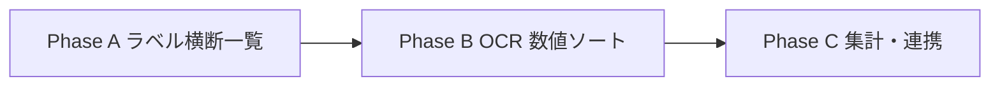

# 書類カタログ・横断ビュー — 将来像（メモ）

最終更新: 2026-06-10

## やりたいこと（ユーザー要望）

税理士事務所として、マトリクス（顧問先 × 期間 × スロット）以外にも、次のような見方・操作がしたい。

| ユースケース | 例 |
|--------------|-----|
| **書類種別で一気に見る** | 「法人税申告書だけ」全顧問先・全期間を一覧 → クリックで PDF プレビュー |
| | 「定款だけ」「消費税申告書だけ」同様 |
| **数値で並べ替え** | 法人税申告書を **課税売上** 順にソート（高い順 / 低い順） |
| | 将来的には利益額・消費税納税額なども同様 |
| **横断比較** | 同業種・同グループ内で申告書の数字を並べて異常値を見つける |

現状のマトリクスは **1 社・1 期間の提出箱** に最適化されている。  
本機能は **書類種別を軸にしたカタログ（横断一覧）** として別レイヤで足す想定。

---

## 現状（2026-06-10）

| 項目 | 状態 |
|------|------|
| スロットラベル | `page.tsx` で期間ごとに固定配列（例: 年次 → 決算報告書 / 元帳 / 法人税 / 消費税） |
| 書類カテゴリマスタ | `DOCUMENT_CATEGORIES`（`organization.ts`）— 定款・法人税申告書など ID 付き |
| 分類 API | `POST /api/classify` — ファイル名 + OCR テキスト → スロット候補（v1） |
| 構造化メタ | **未実装** — `metadata_json` / 課税売上などのフィールドはまだ保存しない |
| 横断一覧 UI | **なし** — 顧問先はマトリクス or `/tasks` の不足一覧のみ |

スロットの `slot_label` は **表示名の文字列** であり、`category_id` との正式な紐づけはまだ弱い（P0.5 スロット一般化・P3 OCR とセットで強化）。

---

## 目指す姿

### 1. カタログビュー（書類種別フィルタ）

```
[ 書類種別 ▼ 法人税申告書 ]  [ 期間 ▼ 2024年分 ]  [ 担当 ▼ すべて ]

顧問先          期間      版      課税売上      状態      操作
─────────────────────────────────────────────────────────────
鈴木商店        R6        v1.2    12,400万     承認済    開く
テック合同      R6        v1.0     3,200万     承認待ち  開く
佐藤商事        R6        —       —            未提出    —
...
```

- 行 = **logical_document**（または最新 `document_version`）1 件
- 列 = 顧問先メタ + **抽出フィールド**（あれば）+ ワークフロー状態
- 「開く」→ 既存 PDF ビューア（マトリクスと同じコンポーネント）

### 2. ソート・フィルタ

| 操作 | データソース（将来） |
|------|---------------------|
| 書類種別 = 法人税のみ | `category_id = tax_return_corporate` |
| 課税売上でソート | `metadata_json.fields.taxable_sales`（抽出済み行のみ） |
| 未提出を除く | `logical_documents` / `document-status` 連携 |
| 担当顧問先のみ | 既存 `client_assignments` + `visible_client_ids` |

ソートキーが空の行（未 OCR・未抽出）は **末尾** または **別タブ「要抽出」** に分ける。

### 3. マトリクスとの関係

| 画面 | 軸 | 用途 |
|------|-----|------|
| **マトリクス**（現行） | 顧問先 × 期間 × スロット | 提出・編集・監査の日常作業 |
| **カタログ**（将来） | 書類種別 × 顧問先（× 期間） | 横断確認・数字比較・一括レビュー |

相互導線:

- カタログ行クリック → 該当スロットのマトリクス or ビューアを開く
- マトリクス上のスロット → `category_id` バッジ表示（将来）

---

## データモデル案

### フェーズ A — ラベルベース（OCR なしでも可能）

スロット確定時に `category_id` を保存する。

```json
{
  "logical_document_id": "...",
  "client_id": "c1",
  "period_key": "year:4",
  "slot_id": "2",
  "slot_label": "法人税申告書",
  "category_id": "tax_return_corporate"
}
```

- `slot_label` → `DOCUMENT_CATEGORIES` の辞書で `category_id` を解決（同名マッピング）
- カタログ API: `GET /api/document-catalog?category_id=tax_return_corporate&period_key=year:4`
- **ソートは状態・日付・顧問先名のみ**（課税売上はまだ不可）

### フェーズ B — 抽出メタ（OCR / AI）

`document_versions.metadata_json` にカテゴリ別フィールド（`backlog-2026-06-02.md` §3 フェーズ B）。

**法人税申告書（`tax_return_corporate`）の例:**

```json
{
  "category_id": "tax_return_corporate",
  "fiscal_year": 2024,
  "fields": {
    "taxable_sales": 124000000,
    "taxable_income": 8500000,
    "corporate_tax_amount": 1700000
  },
  "fields_confidence": {
    "taxable_sales": 0.92,
    "taxable_income": 0.88
  },
  "extraction_engine": "openai",
  "extracted_at": "2026-06-10T12:00:00Z"
}
```

**定款（`articles_of_incorporation`）の例:**

```json
{
  "category_id": "articles_of_incorporation",
  "fields": {
    "company_name": "株式会社 鈴木商店",
    "fiscal_year_end_month": 3,
    "authorized_shares": 1000
  }
}
```

- 信頼度が閾値未満 → カタログでは「—」表示 + 要確認フラグ
- 人の確定値は `confirmed_fields` に分離（AI 推定と混ぜない）

### フェーズ C — 集計・ダッシュボード（P5）

- 顧問先グループ単位の課税売上分布
- 前期比・業種別ベンチマーク（会計連携後）

---

## API 案（将来）

| メソッド | パス | 用途 |
|----------|------|------|
| GET | `/api/document-catalog` | 横断一覧（`category_id`, `period_key`, `sort`, `order`） |
| GET | `/api/document-catalog/fields` | カテゴリごとにソート可能なフィールド定義 |
| POST | `/api/documents/{version_id}/extract` | 手動で再抽出（非同期ジョブ） |

クエリ例:

```
GET /api/document-catalog
  ?category_id=tax_return_corporate
  &period_key=year:4
  &sort=taxable_sales
  &order=desc
  &client_id=c1,c2   # 省略時は visible_client_ids 全体
```

認可: 既存の `document.view` + `client_assignments` / firm-wide ロール。

---

## UI 案

| 画面 | ルート案 | ペルソナ |
|------|----------|----------|
| 書類カタログ | `/catalog` または `/catalog/[categoryId]` | 所長・担当・補佐（matrix シェル） |
| 埋め込み | マトリクス上部タブ「一覧 / マトリクス」 | 同上 |

コンポーネント案:

- `DocumentCatalogTable` — ソート可能テーブル + プレビュー起動
- `CategoryFieldColumns` — カテゴリに応じた動的列（法人税なら課税売上列）
- 既存 `ViewerModal` を再利用

---

## 実装フェーズ（推奨順）



| Phase | 内容 | 出口（完了条件） |
|-------|------|------------------|
| **A** | `category_id` 紐づけ + カタログ API + 一覧 UI（ソートは顧問先名・状態のみ） | 「法人税申告書だけ」で全担当先の提出状況が 1 画面 |
| **B** | 法人税・消費税に限定して課税売上など抽出 + カタログで数値ソート | 課税売上降順で並べ替え、クリックで PDF 確認 |
| **C** | 定款・元帳などカテゴリ拡張、グループ比較、TAXX 連携 | ダッシュボード・アラートと統合 |

**依存:**

- Phase A: P0.5 スロット一般化（安定 `category_id`）、P4 不足資料マスタとの整合
- Phase B: P3 OCR + `metadata_json`（`backlog-2026-06-02.md` §3）
- Phase C: P5 ダッシュボード（`roadmap.md`）

---

## カテゴリ別ソート候補（初期スコープ案）

| category_id | ラベル | ソートに使いたいフィールド（例） |
|-------------|--------|----------------------------------|
| `tax_return_corporate` | 法人税申告書 | 課税売上、課税所得、法人税額 |
| `tax_return_consumption` | 消費税申告書 | 課税売上、納付税額 |
| `ledger` | 総勘定元帳 | —（一覧のみ、数値ソートは後回し） |
| `articles_of_incorporation` | 定款 | 設立日、決算月 |
| `corporate_registry` | 履歴事項全部証明書 | 登記日 |

**v1 の深い抽出は 2 カテゴリに絞る**（法人税 + 消費税）。定款は一覧フィルタのみでも価値がある。

---

## 社内で決めること（着手前）

1. カタログは **専用画面** か **マトリクスのタブ** か（所長は横断、担当は担当先のみ）
2. 課税売上の定義（別表何行目 / OCR プロンプトの根拠）
3. 抽出失敗・未提出行をソートに含めるか（末尾固定が無難）
4. 版が複数あるとき **最新承認版** か **最新版** か
5. クライアント側に同じカタログを見せるか（社長サマリーとの関係）

---

## 関連ドキュメント

| 文書 | 関係 |
|------|------|
| [`backlog-2026-06-02.md`](backlog-2026-06-02.md) §3 | OCR 正規化スコープ、`ExtractedDocumentMeta` |
| [`client-data-vision.md`](client-data-vision.md) | DATA 画面・顧客マスタへの自動正規化・反映 |
| [`roadmap.md`](roadmap.md) P3〜P5 | OCR、不足資料、ダッシュボード |
| [`persona-ui-roadmap.md`](persona-ui-roadmap.md) | 所長・担当の「今日やること」とカタログの導線 |
| `frontend/src/config/organization.ts` | `DOCUMENT_CATEGORIES` |

---

## ステータス

**構想・設計メモのみ — 実装は未着手。**  
再開の優先度は P0 マトリクス安定化 → P3 OCR メタ整備の後、Phase A からが現実的。
