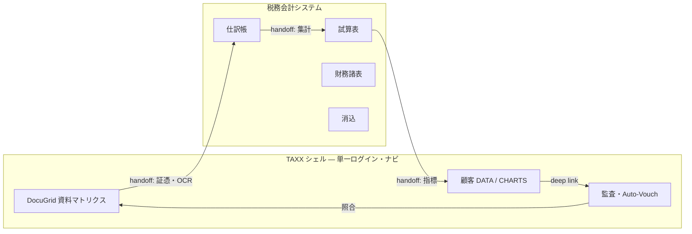

# DocuGrid × 税務会計システム — 統合設計

最終更新: 2026-06-19

> **命名:** 本リポジトリのプロダクト名は **DocuGrid**（資料整理アプリ）。別リポ [accounting-ui](https://github.com/hide-kuwa/accounting-ui) のプロダクト名は **税務会計システム**。両者を含む全体ブランドは **TAXX**。詳細は [`product-naming.md`](product-naming.md)。

## 目的

ユーザーからは **TAXX** としてひとつの税務・会計コックピットに見えるサービスを目指しつつ、実装は **別リポジトリで並行開発** する。

| プロダクト | リポジトリ | 役割（境界） |
|------------|------------|--------------|
| **DocuGrid** | **本リポジトリ**（ローカルフォルダ名 `TAXX`） | 資料マトリクス、PDF・OCR、監査、顧客 DATA・指標、給与ハブ |
| **税務会計システム** | [hide-kuwa/accounting-ui](https://github.com/hide-kuwa/accounting-ui) | 仕訳・試算表・財務諸表・消込・決算（帳簿 SSOT） |

本ドキュメントは **重複・不足・連携契約のたたき台** である。変更時は税務会計システム側のミラー（`docs/handoff/accounting-ui-taxx-mirror.md`）と同期する。

**運用:** 受け口の一覧・手入力可否・SSOT 所有者は [`integration-port-catalog.md`](integration-port-catalog.md) を正とする。

---

## 1. プロダクト上の見え方（統合 UX 原則）



| 原則 | 説明 |
|------|------|
| **シェルは TAXX** | ログイン・顧問先・期間。DocuGrid と税務会計を同一ナビで切替 |
| **帳簿は税務会計システム** | 仕訳 CRUD、試算表、承認、消込は会計側 SSOT |
| **指標は DocuGrid SSOT** | `client_metrics` は DocuGrid が正。会計から **push** で投影 |
| **資料 PDF は DocuGrid SSOT** | `slot_documents` / `document_versions`。会計は参照リンクのみ |
| **見た目の一体感** | 共通デザイン、iframe / サブパス / BFF（Phase B で ADR） |

---

## 2. プロダクト別 — 責務マトリクス

| ドメイン | DocuGrid | 税務会計システム | 統合時の正（SSOT） |
|----------|----------|------------------|-------------------|
| 顧問先 × 期間 × 資料スロット | ◎ マトリクス | △ `customers` | **DocuGrid** |
| PDF 版管理・監査ログ | ◎ P2 進行中 | △ 添付あり | **DocuGrid**（証憑） |
| 試算表 **PDF** | ◎ `monthly_trial_balance` | ○ OCR 別経路 | **DocuGrid**（バイナリ） |
| 試算表 **数値**（科目行） | △ 売上のみ metrics | ◎ 仕訳集計 | **税務会計** → DocuGrid 投影 |
| 仕訳帳（複式） | △ `backend/core` 原型 | ◎ `/api/v1/journals` | **税務会計** |
| 総勘定元帳 | △ core 原型 | ◎ `ledger` | **税務会計** |
| CHARTS 指標 | ◎ `client_metrics.db` | ○ 自前 metrics | **DocuGrid** |
| 給与・源泉・年末調整 | ◎ `payroll_ledger.db` | △ HR 系 | **DocuGrid** |
| 消込・請求 | △ ビジョン | ◎ invoices / reconciliation | **税務会計** |
| 決算・DMN | — | ◎ closing / dmn | **税務会計** |
| Auto-Vouch | ◎ 実装済 | — | **DocuGrid** |
| 構造的 OCR（3 表） | ◎ 計画 | ○ 仕訳 OCR 提案 | **連携** |
| テナント | ◎ 設計中 | ○ org モデル | **マッピング層** |

凡例: ◎ 本格 / ○ 部分 / △ 原型・計画 / — なし

---

## 3. 重複している部分

### 3.1 `backend/core` と税務会計システム

DocuGrid 内の `backend/core/` は税務会計システムの **早期スナップショット** とみなす。

| 項目 | DocuGrid `backend/core` | 税務会計システム |
|------|-------------------------|------------------|
| 仕訳 API | 複式明細 | 版管理 + 承認 |
| 試算表 | `/api/v1/reports/trial-balance` | `trial-balance` 画面 |
| 起動 | **デフォルト非起動** | 独立アプリ |

**方針:** 新機能は税務会計システムのみ。core は凍結。handoff は税務会計 API 形式を正とする。

### 3.2 重複 UI パス

| パス | DocuGrid | 税務会計システム |
|------|----------|------------------|
| `/journal` | core のみ | ◎ メイン |
| `/trial-balance` | core のみ | ◎ メイン |
| `/ocr` | スロット OCR | 仕訳 OCR 提案 |

統合時は TAXX シェルから **`/accounting/*`** 等で名前空間分離。

### 3.3 OCR・仕訳

**重複回避:** DocuGrid ＝資料理解・監査。税務会計システム ＝仕訳確定・帳簿。

---

## 4. 不足している部分（ギャップ）

### 4.1 DocuGrid 側

| ギャップ | 必要なもの |
|----------|------------|
| 会計元帳投影 | handoff 受信 or `accounting_snapshot` |
| 試算表行 OCR | 科目行配列 + 照合 API |
| handoff API | §6 契約の実装 |
| 税務会計タブ | TAXX シェルへの埋め込み |

### 4.2 税務会計システム側

| ギャップ | 必要なもの |
|----------|------------|
| 顧問先 | `external_client_id`（DocuGrid `client_id`） |
| 証憑参照 | DocuGrid `version_id` / `slot_id` |
| 指標 export | DocuGrid `metric_key` マップ |

### 4.3 共同

3 表突合、科目マスタマップ、idempotency、統合認証。

---

## 5. データモデル対応

| DocuGrid | 税務会計システム（拡張） | 備考 |
|----------|--------------------------|------|
| `firm_id` | `organization_id` | 1:1 |
| `client_id` | `customer.external_id` | DocuGrid が正 |
| `period_key` | `fiscal_period.code` | 共有変換 |

Handoff JSON の `source.system` は **`docugrid`**（旧 `taxx` は非推奨）。

---

## 6. Handoff API たたき台（未実装）

### 6.1 DocuGrid → 税務会計システム

`POST /api/v1/handoff/journals`（税務会計側）

```json
{
  "idempotency_key": "docugrid:client-abc:2025-03:batch-001",
  "source": { "system": "docugrid", "slot_id": "ledger", "version_id": "ver-optional" }
}
```

### 6.2 税務会計システム → DocuGrid

`POST /api/handoff/metrics`（DocuGrid 側 — 要実装）

```json
{
  "metrics": [
    { "metric_key": "monthly.revenue", "value_yen": 500000, "source": "tax-accounting:trial-balance" }
  ]
}
```

---

## 7. 開発フェーズ

| Phase | DocuGrid | 税務会計システム |
|-------|----------|------------------|
| **A0** | 本ドキュメント | ミラー配置 |
| **A1** | CSV エクスポート | `/import/local-csv` |
| **A2** | `POST /api/handoff/metrics` | webhook |
| **B0** | TAXX シェル UI | iframe / サブパス ADR | 埋め込みレイアウト |
| **B1** | TAXX JWT 発行（`auth-tenancy-design.md` §11） | トークン検証、独自ログイン廃止 |
| **B2** | `backend/core` 廃止 | — |

---

## 8. コード参照

### DocuGrid（本リポ）

`backend/main.py`, `profile_extractors.py`, `ssot_ingest.py`, `client_metrics_service.py`, `auto_vouching.py`, `backend/core/`（凍結）

### 税務会計システム（accounting-ui リポ）

`backend/api/v1/journals.py`, `financial_statements.py`, `src/app/trial-balance`, `prisma/schema.prisma`

---

## 9. 決定ログ

| 日付 | 決定 |
|------|------|
| 2026-06-19 | handoff で統合、リポ分離維持 |
| 2026-06-19 | 帳簿 SSOT＝税務会計、資料・指標＝DocuGrid |
| 2026-06-19 | プロダクト呼び名を DocuGrid / 税務会計システム / TAXX に整理（`product-naming.md`） |

---

## 10. 関連ドキュメント

| 文書 | 内容 |
|------|------|
| [`extensibility-principles.md`](extensibility-principles.md) | 拡張性の横断原則 |
| [`product-naming.md`](product-naming.md) | **命名の正本** |
| [`auth-tenancy-design.md`](auth-tenancy-design.md) | TAXX 認証シェル・テナント（§11） |
| [`integration-port-catalog.md`](integration-port-catalog.md) | 連携ポート一覧 |
| [`taxx-ecosystem-development-plan.md`](taxx-ecosystem-development-plan.md) | TAXX 全体ビジョン |
| [`ssot-normalization.md`](ssot-normalization.md) | DocuGrid SSOT 原則 |
| [`handoff/accounting-ui-taxx-mirror.md`](handoff/accounting-ui-taxx-mirror.md) | 税務会計側ミラー |

---

## 変更履歴

| 日付 | 内容 |
|------|------|
| 2026-06-19 | 初版 |
| 2026-06-19 | 命名整理: TAXX（本リポ誤称）→ DocuGrid、accounting-ui → 税務会計システム |
