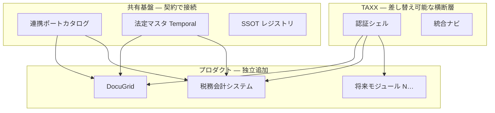

# 拡張性原則（Extensibility Principles）

最終更新: 2026-06-19

TAXX エコシステム（DocuGrid、税務会計システム、将来モジュール）において、**新機能・新プロダクト・法令改定を既存を壊さず足せる** 状態をデフォルトとする。

> **開発デフォルト:** 新機能・リファクタ・連携は本書の原則 E1–E6 と §6 PR チェックリストに従う。例外は ADR / 決定ログに理由を残す。

本ドキュメントは **横断的な開発原則**。機能別の詳細は各専門 doc に委ね、ここでは「何を守れば拡張できるか」をまとめる。

---

## 1. なぜ今の設計は拡張性があるか



| 設計判断 | 拡張性への効き |
|----------|----------------|
| **TAXX ＝認証シェル** | プロダクトを増やしてもログインは1か所。新 API は JWT 検証を足すだけ |
| **リポジトリ分離** | DocuGrid / 税務会計を独立リリース。monolith 化しない |
| **ドメインごと SSOT 1つ** | 新データは「誰が正か」を決めてから API を足す |
| **連携ポートカタログ** | handoff をコード直書きせず、一覧 + `port_id` で増やす |
| **Temporal 法定マスタ** | 税率改定をデプロイなしで seed 追加 |
| **Ingest → Normalize → SSOT** | 新取込源はパイプラインに1段足す |
| **`firm_id` テナント** | 新テーブルにも同じ境界をコピー |

詳細: [`product-naming.md`](product-naming.md)、[`auth-tenancy-design.md`](auth-tenancy-design.md) §11、[`integration-port-catalog.md`](integration-port-catalog.md)、[`temporal-master-pattern.md`](temporal-master-pattern.md)、[`ssot-normalization.md`](ssot-normalization.md)

---

## 2. 基本原則（すべての実装に適用）

### E1 — 境界を先に決める

新機能の前に必ず書く:

| 問い | 例 |
|------|-----|
| どの **プロダクト** の機能か | DocuGrid / 税務会計 / TAXX 横断 |
| **SSOT 所有者** は誰か | 1つだけ |
| **認証** は TAXX JWT で足りるか | `firm_id` / `client_id` スコープ |
| **連携** するなら `port_id` | カタログ行を先に追加 |

### E2 — 契約（API）を先、実装を後

- 新エンドポイント → [`api-contract.md`](api-contract.md) または handoff 文書を同 PR で更新
- 破壊的変更 → バージョン or `idempotency_key` 規約
- フロント専用の隠し API を作らない（将来の別 UI・別プロダクトが使えない）

### E3 — 設定とコードを分離

| コードに書かない | 置き場所 |
|------------------|----------|
| 税率・料率・控除額 | 法定マスタ（`valid_from` / `valid_to`） |
| プロダクト間マッピング | 連携ポートカタログ（[`no-code-config-vision.md`](no-code-config-vision.md) — dev UI / YAML） |
| 顧問先マスタ・権限 | SSOT DB / JSON + サーバー検証 |
| デモ用固定値 | 明示 `seed` / `demo` パス（本番経路と分離） |

### E4 — 時間軸をデータモデルに入れる

- 法令値: `valid_from` / `valid_to`
- 業務データ: 処理日 + `applied_rates` / `master_version_id`（過去を壊さない）
- 監査: immutable 版 + 追記専用イベント

### E5 — 追加はデフォルト、変更は明示

- **新テーブル・新 `port_id`・新 ingest** — 歓迎（既存行に触れない）
- **既存 API の意味変更** — ADR / 決定ログ必須
- **既存 SSOT の上書き语义変更** — マイグレーション + テスト

### E6 — 各層が単体でテスト可能

- 認証: トークン生成と検証を分離
- handoff: ドライラン + `idempotency_key` 再送テスト
- OCR / ingest: スロット ID ごとに extractor を独立

---

## 3. 新プロダクトを足すとき（将来）

**詳細手順:** [`new-product-onboarding.md`](new-product-onboarding.md)（引き継ぎパック・チェックリスト・ミラーテンプレ）

例: 固定資産モジュール、経費精算、法定調書エクスポート

| ステップ | 作業 |
|----------|------|
| 1 | [`product-naming.md`](product-naming.md) に呼び名・スラッグを1行追加 |
| 2 | SSOT 所有者と [`ssot-normalization.md`](ssot-normalization.md) レジストリ行 |
| 3 | [`integration-port-catalog.md`](integration-port-catalog.md) に ingress/egress |
| 4 | TAXX JWT の `aud` にスラッグ追加（必要なら） |
| 5 | 税務会計 / DocuGrid への handoff 契約 |
| 6 | TAXX シェルにナビタブ1つ |

**やらない:** 既存リポに「とりあえず全部」載せる。DocuGrid に仕訳を再実装しない（`backend/core` 教訓）。

---

## 4. 新取込源を足すとき（DocuGrid 内）

[`ssot-normalization.md`](ssot-normalization.md) の3段パイプラインを守る:

```
ingest_* → normalize_* → SSOT upsert
```

- 新 `slot_id` → `profile_extractors.py` に関数1つ
- 新 metric → `client_metrics` キーをレジストリに登録
- 優先順位が複数 ingress なら `profile_normalize_pipeline` + カタログ `precedence`

---

## 5. アンチパターン（拡張性を殺す）

| パターン | なぜダメ |
|----------|----------|
| 同一数字の手入力を複数 UI に | 同期地獄（[`integration-port-catalog.md`](integration-port-catalog.md) §1） |
| `if (date > '2024-04-01')` で税率 | 改定のたびにデプロイ |
| プロダクト横断の god table | SSOT が不明 |
| `admin` 全データスルー | テナント拡張不能 |
| handoff 無文書の API | 3本目の連携で破綻 |
| フロント state が正 | 別クライアント・バッチが使えない |

---

## 6. PR チェックリスト（拡張性）

- [ ] SSOT 所有者は1つに決まっている
- [ ] 新規連携なら [`integration-port-catalog.md`](integration-port-catalog.md) を更新
- [ ] 法定値をコードに書いていない（[`temporal-master-pattern.md`](temporal-master-pattern.md)）
- [ ] API / handoff 契約を文書化した
- [ ] `firm_id`（または将来 equivalent）を新テーブル・API に考慮
- [ ] 過去データを最新マスタで上書きしない設計
- [ ] 既存テストが通る（後方互換）

---

## 7. 現リポジトリでの移行中（拡張性のための負債）

| 負債 | 拡張性への影響 | 解消方向 |
|------|----------------|----------|
| ログインが DocuGrid 内 | TAXX シェル分離で他プロダクト追加が楽に | Auth-1〜3 |
| `firm_id` 未完全 | 新テナント・新プロダクトで漏洩リスク | P1.5 |
| `backend/core` 二重 | 会計拡張の迷い | 凍結 → 削除 |
| `integration_ports.yaml` 未実装 | カタログが doc のみ | Phase I1 |

---

## 8. 関連ドキュメント

| 文書 | 拡張性の観点 |
|------|--------------|
| [`architecture.md`](architecture.md) | ランタイム境界・移行 |
| [`product-naming.md`](product-naming.md) | プロダクト追加時の命名 |
| [`roadmap.md`](roadmap.md) | フェーズガード |
| [`ecosystem-accounting-ui-integration.md`](ecosystem-accounting-ui-integration.md) | プロダクト間 handoff |
| [`auth-tenancy-design.md`](auth-tenancy-design.md) | テナント・認証拡張 |

---

## 変更履歴

| 日付 | 内容 |
|------|------|
| 2026-06-19 | 初版: 横断原則 E1–E6、新プロダクト手順、PR チェックリスト |
