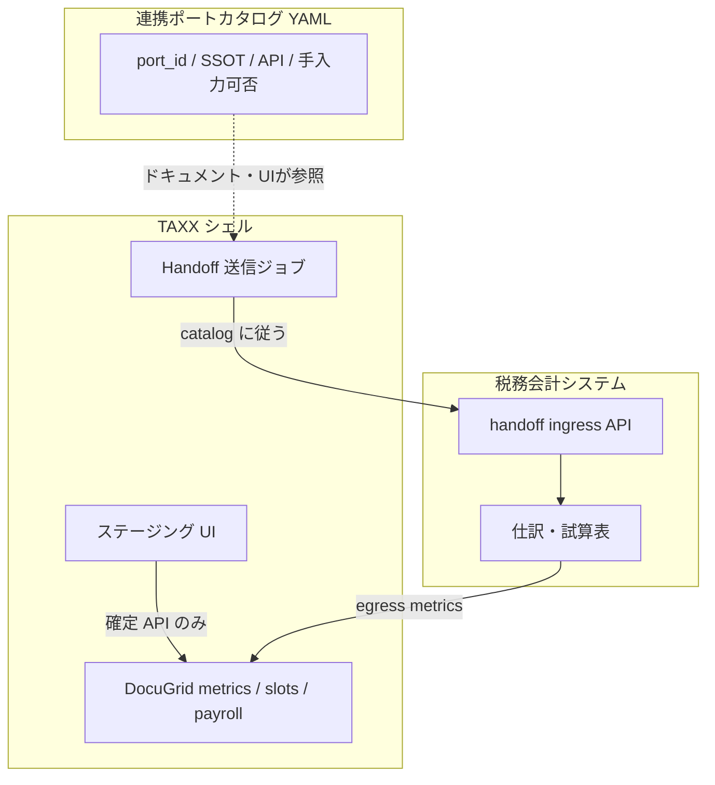

# 連携ポートカタログ（Integration Port Catalog）

最終更新: 2026-06-19

> **命名:** **DocuGrid**（本リポ・資料整理）、**税務会計システム**（accounting-ui リポ）、全体 **TAXX**。→ [`product-naming.md`](product-naming.md)

## 目的

DocuGrid・税務会計システム・共通マスタなど **複数プロダクトを API でつなぐ** とき、

- 「どの数字が、どの受け口に入るか」を **プログラムが読めない人でも一覧で追える**
- 開発者が **マッピングの正本を1か所** でメンテする
- **手入力と API の二重経路** によるバグを設計段階で防ぐ

本ドキュメントは [`ecosystem-accounting-ui-integration.md`](ecosystem-accounting-ui-integration.md) の運用面を補う。  
**拡張性:** 新規ポート追加手順は [`extensibility-principles.md`](extensibility-principles.md) §3–§4。

---

## 1. 結論：どちらがバグりやすいか

### ❌ バグりやすいパターン（避ける）

```
[DocuGrid] 手入力フォーム（売上）  ←──API──┐
                                        ├── 同じ「売上」が2系統
[税務会計] 手入力フォーム（売上）  ←──API──┘
```

各システムに **同じ意味の数字を手で入れられる UI** を用意し、API が「当てはめ」で揃える方式。

| 問題 | 例 |
|------|-----|
| **二重の正** | 会計で直したのに CHARTS が古い / 逆 |
| **上書き競合** | OCR → API と担当者の手修正が交互に勝つ |
| **検知遅れ** | ずれに気づくのが月末 or 顧客指摘 |
| **テスト困難** | 「どちらがソースか」が画面ごとに曖昧 |
| **監査不能** | いつ・誰が・どの経路で確定したか不明 |

### ✅ バグりにくいパターン（推奨）

```
[資料/OCR] → ステージング（要確認）→ API（確定1回）→ [SSOT 所有者]
                                                      ↓ 読み取り専用投影
                                                 [他システムの表示]
```

| ルール | 意味 |
|--------|------|
| **ドメインごとに SSOT 所有者は1つ** | 仕訳→税務会計、指標→DocuGrid metrics、法令値→共通マスタ |
| **下流は原則読み取り専用** | 税務会計の試算表から DocuGrid 指標へ **push** は可。両方向の手入力同期はしない |
| **手入力は SSOT 側かステージングのみ** | キャプチャ「源泉台帳へ」前の確認画面のような **未確定** 領域 |
| **API は最初からつなぐ** | 本番の確定経路は API のみ。CSV はあくまで **同じ API の別トランスポート** |
| **手入力フォールバック** | 障害時用に **明示フラグ** + カタログ登録 + 監査ログ |

**まとめ:** 「受け口＋手入力＋API当てはめ」を **各所に作る** のが危険。**API を正経路にし、手入力は SSOT かステージングに限定** する方が楽で安全。開発者用カタログはその境界を可視化する。

---

## 2. 「受け口（Port）」の定義

受け口は **汎用の数字入力欄ではない**。次の5つをセットで定義する **契約付きエンドポイント**。

| 属性 | 説明 | 例 |
|------|------|-----|
| `port_id` | 一意 ID（人間が読める） | `docugrid.metrics.monthly_revenue` |
| `direction` | `ingress` / `egress` / `bidirectional_staging` | `ingress` |
| `ssot_owner` | どのプロダクトが正か | `docugrid` / `tax-accounting` |
| `api` | HTTP メソッド + パス | `POST /api/handoff/metrics` |
| `schema` | 必須フィールド | `client_id`, `period_key`, `value_yen` |

### 受け口の種類

| 種類 | 手入力 | 用途 |
|------|--------|------|
| **A. SSOT 直書き** | SSOT 所有者の画面のみ | 給与台帳、確定仕訳 |
| **B. ステージング** | 可（確定前） | キャプチャ、OCR 要確認 |
| **C. 投影（read-only）** | 不可 | CHARTS が会計から受け取った売上 |
| **D. 照合（compare-only）** | 不可 | Auto-Vouch（PDF 数値 vs 指標） |

**禁止:** 同じ `port_id` に対して A と C の両方に手入力を置くこと。

---

## 3. 連携ポートカタログ（一覧の中身）

機械可読の正本: 将来 `backend/config/integration_ports.yaml`（現状は本ドキュメント §4 表がたたき台）。

開発者 UI: **`/dev/integration-ports`**（要 `settings.platform`）— 詳細 [`no-code-config-vision.md`](no-code-config-vision.md) §4。

### カタログ1行のテンプレート

| 列 | 説明 |
|----|------|
| 連携名（日本語） | 例: 月次売上 → CHARTS |
| `port_id` | 機械 ID |
| 送信元 | システム + 画面/ジョブ |
| 受信先 | システム + API |
| SSOT 所有者 | 確定後どこが正か |
| 手入力 | 可 / ステージングのみ / 不可 |
| 双方向 | 原則 **不可**（例外はカタログに理由記載） |
| `idempotency_key` | 再送安全キー模板 |
| 関連ドキュメント | 本 catalog / handoff 章 |

---

## 4. たたき台 — 主要ポート一覧

| 連携名 | port_id | 送信元 → 受信先 | SSOT | 手入力 | API |
|--------|---------|-----------------|------|--------|-----|
| 試算表 PDF 保管 | `docugrid.slots.monthly_trial_balance` | マトリクス D&D → DocuGrid | DocuGrid | 資料のみ | `POST /api/slots` |
| 試算表 OCR → 売上指標 | `docugrid.metrics.monthly_revenue` | OCR ingest → metrics | DocuGrid | CHARTS 正規値編集可 | ingest パイプライン |
| 会計試算表 → 指標投影 | `docugrid.metrics.monthly_revenue` | 税務会計 → DocuGrid | DocuGrid（投影） | **不可**（税務会計で直す） | `POST /api/handoff/metrics` |
| 仕訳 CSV 取込 | `tax-accounting.journals.import` | DocuGrid エクスポート → 税務会計 | 税務会計 | 仕訳入力のみ | `POST /import` or handoff |
| 仕訳 JSON handoff | `tax-accounting.journals.ingress` | DocuGrid OCR → 税務会計 | 税務会計 | 税務会計で確定 | `POST /api/v1/handoff/journals` |
| 証憑 deep link | `docugrid.documents.version_ref` | 税務会計仕訳 → DocuGrid PDF | DocuGrid | 不可 | `GET /api/handoff/deep-link/...` |
| 給与月次行 | `docugrid.payroll.ledger_row` | DATA 給与タブ | DocuGrid | SSOT 画面のみ | `PUT /api/payroll/...` |
| キャプチャ → 源泉 | `docugrid.payroll.marufu_apply` | キャプチャ確定 | DocuGrid | ステージングのみ | apply-payroll API |
| 消費税率参照 | `legal.consumption_tax.standard` | 共通マスタ | legal-master | **不可** | `GET .../rates?as_of=` |
| 監査数値照合 | `docugrid.audit.auto_vouch` | 指標 + PDF | DocuGrid | 不可 | `POST /api/audit/auto-link` |

### 衝突しやすい組み合わせ（要設計判断）

| 危険 | 対策 |
|------|------|
| `monthly.revenue` を OCR・CHARTS 手入力・会計 push の3経路 | **優先順位マージ**（`profile_normalize_pipeline`）+ カタログに `precedence` 列を追加 |
| 会計と DocuGrid の両方で仕訳入力 | 税務会計のみ。DocuGrid は **提案→handoff** |
| 最新マスタで過去給与を再計算 | [`temporal-master-pattern.md`](temporal-master-pattern.md) の `applied_rates` |

---

## 5. 開発者用コンフィグページ（案）

### 配置

| 項目 | 値 |
|------|-----|
| URL | `/dev/integration-ports`（開発コンソール内。旧案 `/settings/dev/integration-ports` と同等） |
| 権限 | `settings.platform` または `admin` |
| データ源 | `integration_ports.yaml` + 実行時ヘルスチェック |

### 画面イメージ

```
┌─────────────────────────────────────────────────────────────┐
│ 連携ポートカタログ                    [YAML編集] [再読込]      │
├──────────┬────────┬──────────┬────────┬──────────┬─────────┤
│ 連携名   │ port_id│ SSOT     │ 手入力 │ 最終成功 │ 状態    │
├──────────┼────────┼──────────┼────────┼──────────┼─────────┤
│ 月次売上 │ docugrid…│ DocuGrid │ SSOTのみ│ 2h前    │ 🟢      │
│ 仕訳取込 │ tax-acct…│ 税務会計 │ 会計のみ│ 昨日    │ 🟡 未接続│
└──────────┴────────┴──────────┴────────┴──────────┴─────────┘

詳細: 月次売上 → CHARTS
  送信: 税務会計システム POST /api/handoff/metrics
  受信: DocuGrid client_metrics (monthly.revenue × period_key)
  手入力: DocuGrid CHARTS「正規値」編集可 / 税務会計側の同項目は読取専用
  [テスト送信] [サンプル payload] [関連ドキュメント]
```

### 非開発者向けの読みやすさ

- `port_id` は補助。主ラベルは **日本語の連携名**
- 「誰が正か（SSOT）」を常に1列で表示
- 「手で触っていい画面」を明示（**触ってはいけない投影**に警告色）
- コードパスは折りたたみ（「詳細を見る」）

### 実装フェーズ

| Phase | 内容 |
|-------|------|
| **I0** | 本ドキュメント §4 表を正本（今） |
| **I1** ✅ | `integration_ports.yaml` + 設定 API `GET /api/dev/integration-ports` |
| **I2** ✅ | 設定画面（一覧 + CRUD / YAML 入出力）— `/dev/integration-ports` |
| **I3** ✅ | 最終テスト結果（`/health`）— 本番疎通 ping は今後 |
| **I4** ✅ | テスト送信・ドライラン（`/sample` `/test`） |

---

## 6. 推奨アーキテクチャ（API ファースト + カタログ）



1. **カタログが先** — 実装前に port 行を追加（PR レビューで SSOT・手入力可否を確認）
2. **API 実装はカタログ行に紐づく** — 行なしの handoff コードは CI で警告（将来）
3. **手入力 UI はカタログの `manual_policy` に従う** — `ssot_only` | `staging_only` | `forbidden`

---

## 7. 既存コードとの対応

| 既存 | カタログ上の位置づけ |
|------|---------------------|
| `ssot-normalization.md` Ingest パイプライン | `docugrid.metrics.*` ingress（OCR） |
| CHARTS 正規値編集 | `docugrid.metrics.*` SSOT 手入力（許可） |
| `client_simulation.db` | カタログ外（シミュレーション、確定しない） |
| `profile_normalize_pipeline` 優先順位 | 複数 ingress 時の `precedence` |
| handoff §6 | `tax-accounting.journals.*` / `docugrid.metrics.*` egress |

---

## 8. 関連ドキュメント

| 文書 | 内容 |
|------|------|
| [`product-naming.md`](product-naming.md) | DocuGrid / 税務会計システム / TAXX の呼び分け |
| [`ecosystem-accounting-ui-integration.md`](ecosystem-accounting-ui-integration.md) | プロダクト間 handoff API |
| [`ssot-normalization.md`](ssot-normalization.md) | 業務 SSOT 原則 |
| [`temporal-master-pattern.md`](temporal-master-pattern.md) | 法令マスタ（別ポート群） |
| [`handoff/integration-port-catalog-mirror.md`](handoff/integration-port-catalog-mirror.md) | accounting-ui 配置用ミラー |

---

## 変更履歴

| 日付 | 内容 |
|------|------|
| 2026-06-19 | 初版: 二重手入力の危険、ポート定義、一覧たたき台、dev UI 案 |
| 2026-06-19 | architecture / ssot / roadmap / ecosystem から相互リンク |
| 2026-06-19 | 命名整理（`product-naming.md`）に合わせ port_id・表記を更新 |

## 9. 開発ルール（PR チェック）

新規のシステム間連携・手入力画面を追加するとき:

- [ ] [`integration-port-catalog.md`](integration-port-catalog.md) §4 に行を追加した
- [ ] `ssot_owner` が1つに決まっている
- [ ] 下流画面に同じ意味の手入力欄を置いていない（投影は read-only）
- [ ] 確定経路は API（CSV 含む）である
- [ ] 複数 ingress がある場合は `precedence` を記載した

