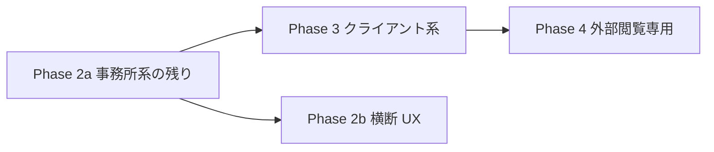

# ペルソナ別 UI — 実装ロードマップ（保留中）

最終更新: 2026-06-10

## 方針

**ペルソナ（ロール）ごとの専用 UI 実装は一旦停止**する。  
本書は再開時に「何を・どの順で・何が完了条件か」を迷わないための作業リスト。

- 業務要件の詳細: [`persona-work-requirements.md`](persona-work-requirements.md)
- 画面の土台・3 層設計: [`persona-ui-design.md`](persona-ui-design.md)
- コード上のウィジェット定義: `frontend/src/config/persona-work-profiles.ts`

### AppRole と Persona の違い

| 軸 | 役割 | 例 |
|----|------|-----|
| **AppRole**（RBAC） | できる操作（権限） | `operator`, `approver`, `client_uploader` |
| **Persona**（UX） | 見せる画面・導線・ウィジェット | `firm_director`, `client_accounting` |

ペルソナ UI は **権限でボタンを隠す**のと **ペルソナでホームを差し替える**のを組み合わせる。  
ロール権限マッピングの管理 UI（`/settings`）は別タスクとして後回し。

---

## 現状サマリ（2026-06-10）

| PersonaId | シェル | ホーム | 実装度 | 備考 |
|-----------|--------|--------|--------|------|
| `client_accounting` | workspace | `/workspace/client_accounting` | **完了** | 提出チェックリスト・差戻し・簡易アップロード |
| `firm_director` | matrix | `/` | **一部** | マトリクス上部 `FirmDirectorDashboard`、承認キュー・全社進捗 |
| `firm_staff_main` | matrix | `/` | **一部** | マトリクス上部 `FirmStaffMainDashboard`、今日やること |
| `firm_staff_support` | matrix | `/` | 未着手 | プレースホルダーのみ |
| `client_executive` | workspace | `/workspace/client_executive` | 未着手 | プレースホルダー |
| `client_sales_expense` | workspace | `/workspace/client_sales_expense` | 未着手 | プレースホルダー |
| `client_controller` | workspace | `/workspace/client_controller` | 未着手 | プレースホルダー |
| `bank` | workspace | `/workspace/bank` | 未着手 | プレースホルダー |
| `tax_office` | workspace | `/workspace/tax_office` | 未着手 | プレースホルダー |
| `platform_admin` | matrix | `/` | 未着手 | `/settings` は別途あり |

### 共通基盤（実装済み）

| 項目 | 内容 |
|------|------|
| 認証 | Cookie セッション + CSRF、`authFetch` / `buildAuthHeaders(clientId)` |
| 顧問先スコープ | `X-Docugrid-Client`、スロットキーからの `scopedClientId` |
| 事務所横断 API | `GET /api/firm-tasks`（不足・承認待ちの集約） |
| タスク画面 | `/tasks`（所長＝全社パネル、担当＝不足一覧） |
| 画面設計 3 層 | platform / firm / member マージ API + 設定 UI |
| 所長ロール | `approver` を firm-wide 扱い（PDF API で client ヘッダー省略可） |

### 開発用ログイン（パスワード: `password`）

| メール | PersonaId | 確認ポイント |
|--------|-----------|--------------|
| `c1@client.example` | `client_accounting` | workspace ホーム |
| `yamamoto@tax.co.jp` | `firm_director` | `/` 上部ダッシュボード、`/tasks` |
| `tanaka@tax.co.jp` | `firm_staff_main` | `/` 上部「今日やること」 |
| `sato@tax.co.jp` | `firm_staff_support` | 現状はマトリクスのみ（ウィジェットなし） |

---

## 再開時の推奨フェーズ



| Phase | 対象 | 目的 |
|-------|------|------|
| **2a** | `firm_staff_support`、事務所系ウィジェットの残り | マトリクス上の業務効率を完成させる |
| **2b** | ナビ共通化、画面設計とウィジェットの紐付け | 非エンジニアが並び替え可能に |
| **3** | `client_executive` / `sales` / `controller` | クライアント向け workspace を揃える |
| **4** | `bank` / `tax_office` | 閲覧専用 + 監査ログの見える化 |

**意図的に後回し:** ロール権限マッピング管理 UI、テナント横断 KPI、OCR 本番パイプライン（`roadmap.md` P3 参照）

---

## ペルソナ別 — やること一覧

### `firm_director`（所長）— 残タスク

| 優先 | widget id | 内容 | API / 依存 | 完了条件 |
|------|-----------|------|------------|----------|
| 1 | `deadline_alerts` | 期限超過・締切間近の一覧 | **新規 API または** document-status 拡張（期限フィールド） | 所長ダッシュボードに表示、クリックで顧問先へジャンプ |
| 2 | — | 担当別ヒートマップ | firm-tasks + client_assignments | 担当スタッフ × 顧問先の滞留が色分けで見える |
| 3 | — | 承認操作のショートカット | 既存ビューア + review-events | キューから直接「承認」「差戻し」に進める（マトリクス経由でも可） |

**既存コンポーネント:** `FirmDirectorDashboard`, `ApprovalQueueWidget`, `FirmProgressWidget`, `hooks/useFirmTasks.ts`

---

### `firm_staff_main`（担当スタッフ）— 残タスク

| 優先 | widget id | 内容 | API / 依存 | 完了条件 |
|------|-----------|------|------------|----------|
| 1 | `classify_queue` | 自動振り分け「要確認」の一覧 | マトリクス `pendingReview` 状態のサーバー永続化（現状はセッション内） | ダッシュボードから要確認 PDF を開き、スロット確定できる |
| 2 | `remand_alerts` | 差戻し対応一覧 | `GET /api/slots` + `logical_status=remanded` | 担当顧問先横断で差戻しが一覧され、再アップロードに遷移 |
| 3 | — | 顧問先・期間のコンテキスト保持 | `setClientScope` / `scopedClientId` | ウィジェットからジャンプ後も正しい期間スロットが開く |

**既存コンポーネント:** `FirmStaffMainDashboard`, `TodayTasksWidget`

---

### `firm_staff_support`（補佐スタッフ）— 未着手

| 優先 | widget id | 内容 | API / 依存 | 完了条件 |
|------|-----------|------|------------|----------|
| 1 | `review_queue` | レビュー待ちスロット | `GET /api/review-events/timeline` + workflow_status フィルタ | マトリクス上部に補佐用パネル、行クリックで該当スロットを開く |
| 2 | `remand_history` | 差戻し履歴 | `GET /api/review-events`（event_type=remand） | 理由付きで直近 N 件表示 |
| 3 | — | 監査リンク未完了 | audit-links API | リンク未保存・未確認のスロットが一覧される |

**新規コンポーネント案:** `FirmStaffSupportDashboard`（`FirmDirectorDashboard` と同型）

---

### `client_accounting`（担当経理）— 拡張のみ

| 優先 | 内容 | 完了条件 |
|------|------|----------|
| 1 | モバイル向けアップロード UX | スマホ幅でチェックリスト・撮影提出が操作可能 |
| 2 | 期限の明示表示 | document-status または要件マスタに期限日を追加して表示 |
| 3 | 提出履歴ウィジェット | review-events から提出・差戻しの時系列 |

**既存:** `ClientAccountingHome` + 3 ウィジェット（完了）

---

### `client_executive`（社長）

| 優先 | widget id | 内容 | API | 完了条件 |
|------|-----------|------|-----|----------|
| 1 | `exec_summary` | 完了率・未提出・承認待ちの 1 画面サマリ | `GET /api/document-status` | `ClientExecutiveHome` workspace で閲覧のみ |
| 2 | `risk_highlights` | リスク・期限ハイライト | 将来 KPI / 期限 API | Phase 3 後半または P3 OCR 連携後 |

---

### `client_sales_expense`（営業・経費）

| 優先 | widget id | 内容 | 完了条件 |
|------|-----------|------|----------|
| 1 | `expense_submit` | 月次スロットへの提出 UI | `month:*` 期間を選び PDF/画像を 1 タップ提出 |
| 2 | `expense_status` | 精算ステータス | workflow_status を人間向けラベルで表示 |

---

### `client_controller`（管理会計）

| 優先 | widget id | 内容 | 完了条件 |
|------|-----------|------|----------|
| 1 | `mgmt_submit` | 管理会計資料の提出リスト | 必須スロットと提出状況を一覧、未提出からアップロード |

---

### `bank` / `tax_office`（外部・閲覧専用）

| 優先 | widget id | 内容 | 依存 | 完了条件 |
|------|-----------|------|------|----------|
| 1 | `shared_docs` / `filing_docs` | 共有・申告資料一覧 | slots + **共有フラグ API（未設計）** | 閲覧のみ、ダウンロードは監査ログ付き |
| 2 | `access_log` | アクセス・DL 履歴 | `GET /api/audit-events`（client スコープ） | 自組織の閲覧履歴が workspace に表示 |

**設計が必要:** どの client / slot を外部に「共有」するか（`shared_with` メタ or 専用 assignment）

---

### `platform_admin`（プラットフォーム管理者）

| 優先 | widget id | 内容 | 完了条件 |
|------|-----------|------|----------|
| 1 | `tenant_health` | テナント横断サマリ | 複数 firm の件数・拒否ログ（platform 権限） |
| 2 | `settings_shortcut` | 設定ショートカット | `/settings` 各タブへの導線 |

現状は `/settings` で代替可能。専用ホームは優先度低。

---

## 横断タスク（どのペルソナでも関係）

| ID | 内容 | 状態 | 再開時のメモ |
|----|------|------|--------------|
| X-1 | `PersonaNav` 共通化 | 未着手 | `personas.ts` の `navItems` を権限フィルタ付きコンポーネントに |
| X-2 | 画面設計 3 層 ↔ ウィジェット ON/OFF | 一部 | `ScreenDesignPanel` と `persona-work-profiles` の widget id を一致させる |
| X-3 | マトリクス枠レイアウト一括反映 | 未着手 | [`backlog-2026-06-02.md`](backlog-2026-06-02.md) §2.2 |
| X-4 | PDF API の client スコープ | **完了** | `buildAuthHeaders(clientId)`、スロットキー優先 |
| X-5 | 所長の顧問先ジャンプ | **完了** | ダッシュボード行クリックで staff/client 切替 |

---

## 実装時のファイル置き場（テンプレ）

新しいペルソナホームを足すとき:

```
frontend/src/features/persona/
  homes/
    ClientAccountingHome.tsx      # 参考実装
    FirmStaffSupportHome.tsx      # workspace 向け（必要なら）
  FirmDirectorDashboard.tsx       # matrix 上部パネル型
  FirmStaffMainDashboard.tsx
  widgets/
    <WidgetName>.tsx
  hooks/
    use<Feature>.ts

frontend/src/features/persona/homes/index.ts   # PERSONA_HOMES に登録
frontend/src/config/persona-work-profiles.ts   # status を implemented に更新
frontend/src/app/page.tsx                      # matrix シェルは上部パネル追加
```

---

## 再開のトリガー（いつこのロードマップに戻るか）

次のいずれかが揃ったら Phase 2a から再開する想定:

1. マトリクス P0（スロット一般化・Docugrid 自動保存）が smoke 合格
2. 本番認証（Google OAuth / CORS）が通った
3. プロダクト上「事務所スタッフの 1 日の導線」デモが必要になった

それまでは **本書と `persona-work-profiles.ts` の同期だけ維持**し、コードの新規ペルソナ UI は増やさない。

---

## 関連ドキュメント

| 文書 | 用途 |
|------|------|
| [`persona-work-requirements.md`](persona-work-requirements.md) | 業務・必要情報の洗い出し |
| [`persona-ui-design.md`](persona-ui-design.md) | シェル・3 層・ログイン導線 |
| [`roadmap.md`](roadmap.md) | プロダクト全体の P0〜P5 |
| [`明日への課題.md`](明日への課題.md) | 短期メモ |
| [`backlog-2026-06-02.md`](backlog-2026-06-02.md) | 注釈・枠編集・OCR |
