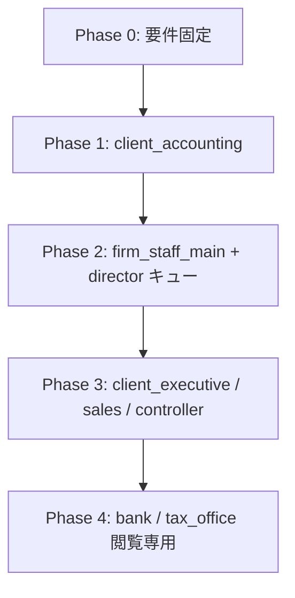

# ペルソナ別 業務・必要情報 洗い出し

最終更新: 2026-06-10

## 目的

ペルソナ UI を作る前に、**各ユーザーが日々何をするか**と、それに必要な**情報・API・画面**を整理する。  
実装の優先順位とウィジェット設計の根拠とする。

関連: [`persona-ui-design.md`](persona-ui-design.md)、[`api-contract.md`](api-contract.md)

---

## 共通のデータモデル（前提）

| 概念 | 説明 | 主な API |
|------|------|----------|
| 顧問先 | `client_id`（例: `c1`） | `GET /api/client-master` |
| 期間 | `period_key`（`perm` / `year:N` / `month:N`） | マトリクス・スロットと共通 |
| スロット | 必須書類 1 枠（インデックス `0`..`n-1`） | `POST/GET /api/slots` |
| 論理資料 | client × period × slot の容器 | `logical_documents` |
| 版 | 不変 PDF スナップショット | `document_versions` |
| ワークフロー | uploaded → processing → approved / remanded | `review_events` |
| 充足状況 | 必須 − 提出済み | `GET /api/document-status` |

必須書類マスタ（v1）: `backend/services/requirements.py`  
— `perm` 4 点、`year` 4 点、`month` 4 点

---

## ペルソナ別 業務マトリクス

### 1. `firm_director`（税理士事務所・所長）

| 項目 | 内容 |
|------|------|
| **主な業務** | 全顧問先の進捗俯瞰、承認判断、リスク・期限の把握、担当配分の確認 |
| **判断に必要な情報** | 顧問先別の提出完了率、承認待ち件数、差戻し・期限超過、担当スタッフ別の滞留 |
| **よくする操作** | 承認、差戻し、マトリクスで資料確認、監査タイムライン閲覧 |
| **スコープ** | firm 内の**全顧問先**（`firm_admin` / `approver` 相当） |
| **既存 UI/API** | 資料マトリクス `/`、`/tasks`（不足・承認待ち）、`GET /api/document-status`（顧問先単位）、`GET /api/review-events/timeline` |
| **不足** | 顧問先横断の承認キュー 1 画面、担当別ダッシュボード、アラート集約 |
| **優先ウィジェット** | ①承認キュー ②全社進捗サマリー ③期限アラート ④担当別ヒートマップ |

---

### 2. `firm_staff_main`（担当スタッフ）

| 項目 | 内容 |
|------|------|
| **主な業務** | 割当顧問先の資料収集・整理、PDF アップロード、OCR/振り分け、DocuGrid 編集、監査リンク作成 |
| **判断に必要な情報** | 担当顧問先の未提出スロット、要確認（分類グレー）、差戻し対応中、今日の期限 |
| **よくする操作** | スロットへ PDF アップロード、ビューアで注釈・版保存、分類確認、顧問先への催促 |
| **スコープ** | `client_assignments` で割当された顧問先のみ |
| **既存 UI/API** | マトリクス、`POST /api/slots`、`POST /api/classify`、`POST /api/docugrid/save`、`POST /api/review-events` |
| **不足** | 担当顧問先に絞った「今日やること」デフォルト、要確認キュー専用パネル |
| **優先ウィジェット** | ①未提出チェックリスト ②要確認（分類）キュー ③差戻し対応一覧 ④直近タイムライン |

---

### 3. `firm_staff_support`（補佐スタッフ）

| 項目 | 内容 |
|------|------|
| **主な業務** | サブ担当顧問先のレビュー、照合コメント、差戻し提案（承認は所長）、補助アップロード |
| **判断に必要な情報** | レビュー待ちスロット、監査リンクの未確認、差戻し履歴と理由 |
| **よくする操作** | ビューアで照合、コメント、差戻し（権限あれば）、監査リンク確認 |
| **スコープ** | 割当顧問先のサブセット（`reviewer` ロール） |
| **既存 UI/API** | マトリクス（閲覧・注釈）、`audit.link` 権限、`GET /api/review-events` |
| **不足** | レビュー待ち専用キュー（workflow_status ベース）、差戻し理由の一覧 |
| **優先ウィジェット** | ①レビュー待ち ②差戻し履歴 ③監査リンク未完了 |

---

### 4. `client_accounting`（クライアント・担当経理）★ 最初に実装

| 項目 | 内容 |
|------|------|
| **主な業務** | 税理士から依頼された資料の提出、差戻し修正の再提出、提出状況の確認 |
| **判断に必要な情報** | 何が未提出か（書類名・期限）、差戻し理由、提出済みの確認、次の締切 |
| **よくする操作** | PDF/画像アップロード（スロット指定）、差戻し資料の差し替え、進捗確認 |
| **スコープ** | 自社 `client_id` のみ（通常 1 社） |
| **既存 UI/API** | `GET /api/document-status`、`POST /api/slots`、`GET /api/slots`、`GET /api/review-events` |
| **不足** | ワークスペース専用の提出 UI（マトリクスは事務所向け）、モバイル向けアップロード、期限表示 |
| **権限ギャップ** | `viewer` ではアップロード不可 → **`client_uploader` ロール**を追加（経理・営業・管理会計） |
| **優先ウィジェット** | ①提出チェックリスト ②差戻しアラート ③簡易アップロード ④提出履歴 |

---

### 5. `client_executive`（クライアント・社長）

| 項目 | 内容 |
|------|------|
| **主な業務** | 経営判断に必要なサマリー確認、重要書類の閲覧、社内承認（必要な場合） |
| **判断に必要な情報** | 決算・申告の完了状況、税務リスクフラグ、未解決の差戻し件数、承認待ち |
| **よくする操作** | 閲覧のみが中心、重要資料 PDF の確認 |
| **スコープ** | 自社、閲覧中心（`viewer`） |
| **既存 UI/API** | `GET /api/document-status`（サマリ）、`GET /api/slots/{id}/file` |
| **不足** | 経営向け KPI サマリー、リスクハイライト、グラフ |
| **優先ウィジェット** | ①完了率サマリー ②リスク・期限ハイライト ③重要書類ショートカット |

---

### 6. `client_sales_expense`（クライアント・営業・経費）

| 項目 | 内容 |
|------|------|
| **主な業務** | 経費領収書の撮影・提出、精算ステータス確認、差戻し対応 |
| **判断に必要な情報** | 未提出の経費月、差戻し理由、承認済み/処理中 |
| **よくする操作** | モバイルから PDF/画像アップロード、特定スロット（月次の請求書綴り等）へ提出 |
| **スコープ** | 自社、経費関連スロット中心 |
| **既存 UI/API** | スロット API（月次 `month:*` が該当しやすい） |
| **不足** | 経費カテゴリ、撮影 UI、精算フロー追跡（会計システム連携は P5） |
| **優先ウィジェット** | ①経費提出（月次） ②精算ステータス ③差戻し |

---

### 7. `client_controller`（クライアント・管理会計）

| 項目 | 内容 |
|------|------|
| **主な業務** | 管理会計資料（予実・部門 PL 等）の定期提出 |
| **判断に必要な情報** | 部門別提出状況、未提出レポート、差戻し |
| **よくする操作** | Excel/PDF アップロード、期間指定提出 |
| **スコープ** | 自社 |
| **既存 UI/API** | スロット API、document-status |
| **不足** | 部門マスタ、予実テンプレート紐付け（将来） |
| **優先ウィジェット** | ①管理会計提出リスト ②部門別進捗（将来） |

---

### 8. `bank`（銀行）

| 項目 | 内容 |
|------|------|
| **主な業務** | 融資・与信審査のための限定資料閲覧 |
| **判断に必要な情報** | 共有された決算書・試算表・法人登記、有効期限、アクセスログ |
| **よくする操作** | 閲覧・ダウンロード（監査付き） |
| **スコープ** | 明示共有された client / 資料のみ（`viewer`、アップロード不可） |
| **既存 UI/API** | `GET /api/slots`、`GET /api/slots/{id}/file`、`GET /api/audit-events` |
| **不足** | 共有フォルダ UI、期間限定 URL、ダウンロード監査の見える化 |
| **優先ウィジェット** | ①共有資料一覧 ②アクセス・DL 履歴 |

---

### 9. `tax_office`（税務署）

| 項目 | 内容 |
|------|------|
| **主な業務** | 申告関連資料の照会・閲覧 |
| **判断に必要な情報** | 申告書・添付資料、照会対応の記録、提出期間 |
| **よくする操作** | 閲覧のみ |
| **スコープ** | 照会対象 client の限定資料 |
| **既存 UI/API** | スロット閲覧、監査ログ |
| **不足** | 申告書スロットへのショートカット、照会ログ UI |
| **優先ウィジェット** | ①申告関連資料 ②照会ログ |

---

### 10. `platform_admin`（プラットフォーム管理者）

| 項目 | 内容 |
|------|------|
| **主な業務** | 全テナント横断の運用、権限・設定、障害対応 |
| **判断に必要な情報** | テナント一覧、監査拒否ログ、設定変更履歴 |
| **よくする操作** | グローバル設定、ロール権限、メンバー管理 |
| **スコープ** | 全 firm（`settings.platform`） |
| **既存 UI/API** | `/settings`、firm members、screen design platform 層 |
| **不足** | テナント横断ダッシュボード |
| **優先ウィジェット** | ①テナント健全性 ②監査拒否サマリー ③設定ショートカット |

---

## 実装フェーズ（推奨順）

> **2026-06-10:** ペルソナ別 UI の追加実装は一旦停止。再開時の作業リストは [`persona-ui-roadmap.md`](persona-ui-roadmap.md) を参照。

| Phase | ペルソナ | ウィジェット | 状態（2026-06-10） |
|-------|----------|--------------|-------------------|
| **1** | `client_accounting` | 提出チェックリスト、差戻し、簡易アップロード | **完了** |
| **2** | `firm_staff_main`, `firm_director` | 今日やること、承認キュー、全社進捗 | **一部完了**（期限アラート・要確認キュー・補佐は未着手） |
| **3** | 他クライアント系 | サマリー、経費 UI | 未着手 |
| **4** | `bank`, `tax_office` | 共有資料閲覧 | 未着手 |

---

## ウィジェット ID レジストリ（画面設計 3 層と連携）

| widget id | ラベル | 対象ペルソナ | データソース |
|-----------|--------|--------------|--------------|
| `submit_checklist` | 提出チェックリスト | client_accounting | `GET /api/document-status` |
| `remand_alerts` | 差戻し対応 | client_* , firm_staff_* | `GET /api/slots` + review-events |
| `quick_upload` | 簡易アップロード | client_accounting, client_sales_expense | `POST /api/slots` |
| `approval_queue` | 承認待ち | firm_director | document-status `pending_approval` |
| `today_tasks` | 今日やること | firm_staff_main | document-status + classify キュー |
| `review_queue` | レビュー待ち | firm_staff_support | review-events timeline |
| `exec_summary` | 経営サマリー | client_executive | document-status 集約 |
| `shared_docs` | 共有資料 | bank, tax_office | slots（共有フラグ将来） |

---

## RBAC 調整（Phase 1 で実施）

| ロール | 権限 | 割当 |
|--------|------|------|
| `client_uploader` | view + upload | 経理・営業・管理会計ペルソナ |
| `viewer` | view のみ | 社長・銀行・税務署 |

---

## 次のアクション

1. ✅ 本ドキュメントで業務・情報を固定
2. ✅ `client_uploader` ロール追加
3. ✅ `ClientAccountingHome` + `submit_checklist` ウィジェット実装
4. ✅ 所長・担当のマトリクス上部ダッシュボード（一部）
5. ⏸ **ペルソナ別 UI の追加は保留** — 再開リストは [`persona-ui-roadmap.md`](persona-ui-roadmap.md)
