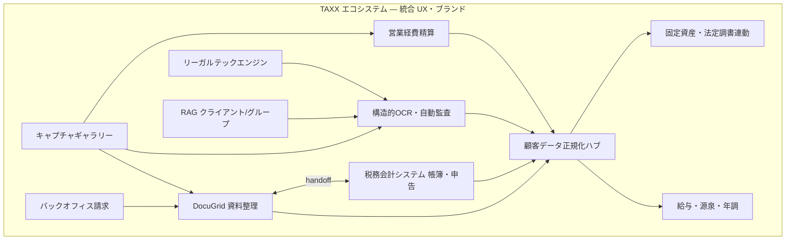

# TAXX 次世代税務会計エコシステム 開発計画書

最終更新: 2026-06-17

本ドキュメントは、税務会計実務における認知負荷を極限まで下げ、AI と実務家が最高の住み分けを実現するための次世代プロダクト **TAXX** および **DocuGrid** のコア機能拡張に関する包括的な開発計画書である。

実装の詳細フェーズ・API 契約・現行コードとの対応は、併せて以下を参照する。

| 文書 | 内容 |
|------|------|
| [`roadmap.md`](roadmap.md) | 現行リポジトリのフェーズ（P0–P5）とテーブル定義 |
| [`client-data-vision.md`](client-data-vision.md) | DATA 画面・顧客データ正規化ハブ |
| [`docugrid-matrix-model.md`](docugrid-matrix-model.md) | マトリクス・セル座標の基本思想 |
| [`document-catalog-vision.md`](document-catalog-vision.md) | 書類種別横断カタログ |
| [`auth-tenancy-design.md`](auth-tenancy-design.md) | 事務所テナント・認可 |
| [`architecture.md`](architecture.md) | ランタイムアーキテクチャ |
| [`product-naming.md`](product-naming.md) | DocuGrid / 税務会計システム / TAXX の呼び分け |
| [`ecosystem-accounting-ui-integration.md`](ecosystem-accounting-ui-integration.md) | DocuGrid × 税務会計システム handoff |
| [`temporal-master-pattern.md`](temporal-master-pattern.md) | 法定基準値の履歴管理マスタ（ハードコーディング禁止） |
| [`integration-port-catalog.md`](integration-port-catalog.md) | 連携ポート一覧・API ファースト・dev コンフィグ案 |
| [`extensibility-principles.md`](extensibility-principles.md) | **拡張性の横断原則**（開発デフォルト・PR チェックリスト） |
| [`new-product-onboarding.md`](new-product-onboarding.md) | 新プロダクト / 新リポ追加時の引き継ぎ |
| [`payroll-withholding-year-end-vision.md`](payroll-withholding-year-end-vision.md) | まるふ OCR → 源泉徴収簿 → 社保・源泉 → 年末調整 |
| [`capture-gallery-ux-vision.md`](capture-gallery-ux-vision.md) | ログイン即カメラ・Pinterest 風 Masonry ギャラリー |
| [`expense-reimbursement-vision.md`](expense-reimbursement-vision.md) | 営業経費精算（RAG・インボイス・交通費自動化） |

---

## 1. プロダクトビジョンと本質的価値

既存の会計・税務ソフトは「データの入力・保管」に終始しており、数字の整合性チェックや法規適合の判断という **人間による神経衰弱的な突合** をユーザーに丸投げしている。

TAXX が目指すのは、**実務家の脳のメモリを 1MB も無駄遣いさせない世界** である。AI が財務ロジックと言語的文脈を理解し、裏で全ての突合と監査を終わらせ、人間は最後の **「判断と責任」** にのみ集中できる最強のコックピットを構築する。

### 設計原則（要約）

| 原則 | 意味 |
|------|------|
| **突合は機械、判断は人間** | 整合性・法適合の機械チェックを徹底し、グレーはサジェスト + ワンタップ確認 |
| **シングルソース** | 会計・給与・固定資産・申告・法定調書を分断しないデータ構造 |
| **テナント隔離** | 顧問先ごとの RAG・データは完全分離。グループ俯瞰は事務所側のみ |
| **認知負荷最小** | 安全な領域はトーンダウン、異常・未確認のみスポットライト |
| **拡張性優先** | 新プロダクト・連携・法令改定は既存を壊さず足せる境界で設計 — [`extensibility-principles.md`](extensibility-principles.md) |
| **ノーコード優先** | マスタ・連携・マッピングはコンフィグ UI。コード変更は最小 — [`no-code-config-vision.md`](no-code-config-vision.md) |

---

## 2. コア機能要件と実装ロジック

### 2.1 バックオフィス自立化（契約・請求・消込・利用料）

自社プロダクト DocuGrid の利用料請求を含め、顧問先との **契約締結・請求書発行・入金確認・自動消込（マッチング）** をシームレスに統合する。

- プロダクト自体のマネタイズ動線を自動化
- 回収漏れ・管理工数のゼロ化
- ビジネスプラットフォームとしての自立

### 2.2 構造的 OCR と自動監査

単なる文字起こし（従来の OCR）を超え、**仕訳帳・試算表・決算書の 3 表** の財務ロジックと構造的な繋がりをシステム側が理解する **構造的 OCR** を実装する。

- 読み込んだ各種資料から、データの矛盾・ズレを自動監査
- 正しいデータ世界の再構築
- 現行リポジトリとの接点: P3 OCR・振り分け（`roadmap.md`）、`ExtractedDocumentMeta`（`backlog-2026-06-02.md` §3）

### 2.3 実務家特化型 UI/UX（トーンダウンナビゲーション）

確定申告書等のチェックにおいて、実務家の視覚的ノイズを極限まで排除する。

**例:** 「別表四の一番上（当期利益の額）」と「損益計算書の税引後利益」が一致しているなど、整合性が取れている安全な領域をあえて **トーンダウン（暗転）** させ、確認すべき異常値・未確認スポットにのみ視覚的スポットライトを当てる。

### 2.4 思考ステップ同期型チェックリスト

システムに人間が合わせるのではなく、**人間の監査手順に画面が 100% 先回り** するナビゲーションを構築する。

- チェックリスト項目（例: 預金残高確認）を選択
- 対応する通帳 OCR データと仕訳画面が自動で並置
- 完了とともに次ステップへ画面が同期遷移

### 2.5 セキュアなクライアント限定 RAG & グループ統合 RAG

| 種別 | 説明 |
|------|------|
| **クライアント限定 RAG** | マルチテナント分離を徹底。各社の歴史・総勘定元帳・確定申告書・税務判断文脈を完全隔離して学習 |
| **グループ統合 RAG** | 税理士事務所側のみ利用可能なクロス・テナント RAG。複数子会社を抱えるグループ全体の財務・税務を横断俯瞰・突合する「神の視点」 |

認可・データ分離の前提: `auth-tenancy-design.md`

### 2.6 リーガルテック適合エンジン（健康保険・税務通達）

毎年改定される **健康保険料率・標準報酬月額** のルール、および **最新の税務通達・法改正** を知識ベースとして保持する。

- 給与・仕訳データへの自動適用
- 随時改定（月変）対象者の抽出
- 古い料率の警告
- 通達ベースの特例適用要件の自動判定

**実装前提:** 税率・料率・控除額はソースコードに書かず、[`temporal-master-pattern.md`](temporal-master-pattern.md) の共通マスタ（`valid_from` / `valid_to`）から `transaction_date` 指定で取得する。過去帳簿は当時マスタでイミュータブルに検証可能であること。

### 2.7 賃上げ促進税制の全自動シミュレーション

実務上「忘れがち」な賃上げ促進税制に対し、期中から **給与総額の増加率・教育訓練費の割合** をリアルタイム自動計算する。

- 決算前に適用可能な控除税額をサジェスト
- AI が仕訳品目から「教育訓練費」候補を自動抽出
- DocuGrid 内の証明書類（領収書等）と紐付け

### 2.8 固定資産台帳 ⇔ 法定調書・地方税の完全連動

1 月繁忙期のデータ分断を解消するため、以下を自動連動させる。

| 実務対象（固定資産台帳） | 連動先（法定調書・地方税申告） | 自動化ロジック |
|--------------------------|--------------------------------|----------------|
| 不動産の取得・譲渡（土地・建物） | 不動産等の譲受の対価の支払調書 | 売買契約書 OCR から売主情報・対価を自動抽出し、支払調書へダイレクト流し込み |
| 資産の除却・移動・自治体設定 | 償却資産申告書（各自治体） | 期中の除却仕訳・ステータス変更を検知し、該当自治体の減少資産明細へリアルタイムプロット |
| 権利金・更新料（長期前払費用） | 不動産の使用料等の支払調書 | 繰延資産としての台帳登録と同時に、支払先（大家・仲介業者）情報を支払調書マスターへ自動紐付け |

### 2.9 給与台帳・源泉徴収簿の内製化と報酬源泉自動トラッキング

会計と給与計算の分断という最大のバグを解消するため、TAXX 内に **給与台帳・源泉徴収簿のデータ構造を内包**（シングルソースオブトゥルース）させる。

- 給与確定時に 1 円の狂いもなく預り金等の仕訳を自動生成
- 年末調整から法定調書合計表へダイレクト連動

**拡張ビジョン（詳細: [`payroll-withholding-year-end-vision.md`](payroll-withholding-year-end-vision.md)）**

| 能力 | 説明 |
|------|------|
| まるふ × 控除証明書 OCR | 申告書と証明額の自動突合、配偶者控除要件の自動判定 |
| 社保・源泉自律ループ | 算定基礎届 → 等級反映 → 10 月切替の無人化、税額表ルックアップ |
| 年末調整ボタン | 蓄積台帳 + OCR 控除の統合 → 過不足給与 → 源泉徴収票・法定調書 |

### 2.10 キャプチャファースト・視覚的ドキュメントギャラリー

ログイン直後にカメラが起動し、撮影資料が **Pinterest 風 Masonry** で並ぶ UI。文字リストではなくサムネイルで資料を識別し、OCR/監査ステータスをカードの枠・トーンダウン・ピン留めで表現する。

詳細: [`capture-gallery-ux-vision.md`](capture-gallery-ux-vision.md)

- DocuGrid マトリクスを **補完** するモバイル回収入口・要確認ビュー
- まるふ提出・経費レシートなど **撮影起点** のワークフロー共通基盤

### 2.11 営業経費精算の自動化

営業は「パシャリ」、経理は赤カードのみ。レシート OCR + カレンダー/CRM コンテキスト RAG + インボイス公表サイト突合 + 交通費自動生成（定期控除・重複検知）を、§2.10 のギャラリー UX 上で完結させる。

詳細: [`expense-reimbursement-vision.md`](expense-reimbursement-vision.md)

**プロトタイプ優先:** 交際費のインボイス × カレンダー自動突合

---

## 3. 技術的難題へのアプローチ:「独自科目」と「源泉義務」のマッピング

クライアントごとに異なる **独自勘定科目** から源泉徴収義務の有無を正しく判定するため、科目名のみに依存しない **「2 軸（OCR × マスター）マッピング」** を採用する。

### 実態軸（OCR / RAG）

請求書等から以下を検知し、取引の実態として源泉対象マークを付与する。

- 「源泉所得税」の表記
- 「デザイン料」「原稿執筆」等のキーワード
- 個人名（振込先）

### マスター軸（自動学習）

一度判定された取引先（例: 個人デザイナー）のマスターに **源泉徴収対象フラグ** を裏で自動起票し、次回以降は独自科目で仕訳しても支払調書・源泉徴収の対象として正確に集計・紐付けする。

### グレーゾーンの UX

AI 判定がグレーな領域（例: 個人エンジニアへの外注費の実態）では、完全自動化に固執せず、**自動監査画面で実務家に「含まれる / 含まれない」をワンタップ選択** させるサジェスト UX を配置し、安全性を 100% 担保する。

---

## 4. 開発ロードマップ（フェーズ分け案）

本計画書の Phase は **プロダクト全体の戦略フェーズ**。リポジトリ現行の P0–P5 との対応は [`roadmap.md`](roadmap.md) で別管理する。

| フェーズ | 開発対象機能 | 実務上のゴール |
|----------|--------------|----------------|
| **Phase 1（基礎）** | バックオフィス自立化、構造的 OCR、思考ステップ同期型 UI | DocuGrid 利用料回収の自動化と、3 表の構造的整合性チェックの基礎確立 |
| **Phase 2（拡張）** | クライアント限定 / グループ統合 RAG、報酬源泉の 2 軸マッピング | 各社専用 AI 文脈の隔離と、士業・デザイナー源泉の自動トラッキングによる 1 月決戦の負担軽減 |
| **Phase 3（統合）** | 給与台帳・源泉徴収簿内製化、固定資産 ⇔ 法定調書完全連動、まるふ OCR → 年調 | 会計・給与・固定資産のデータ完全融合。年末調整・償却資産申告の自動化 |
| **Phase 3.5（体験）** | キャプチャギャラリー UX、営業経費プロトタイプ（交際費×インボイス×カレンダー） | 資料回収・経費の心理的ハードル除去。赤カード監査の実証 |
| **Phase 4（極致）** | リーガルテック適合、賃上げ促進税制リアルタイム判定、トーンダウン UI 完成 | 法改正の自動適合、攻めのコンサル提案の自動化、認知負荷ゼロに近い UX の完成 |

### 現行コードベースとの対応（2026-06-17 時点）

| 本計画 Phase 1 要素 | 現行リポジトリでの位置づけ |
|---------------------|---------------------------|
| 構造的 OCR（基礎） | `roadmap.md` P3、分類 API、`ocrTarget` カテゴリ |
| 思考ステップ UI | 未着手（マトリクス + PDF ビューアが原型） |
| バックオフィス自立化 | 未着手（DocuGrid は資料マトリクス中心） |
| 顧客データ正規化 | `client-data-vision.md` D0–D1、DATA ワークスペース |
| 自動監査・版管理 | `roadmap.md` P2（版管理・監査イベント） |
| トーンダウン UI | 未着手 |
| RAG | 未着手（設計のみ） |

---

## 5. TAXX エコシステム内の DocuGrid と税務会計システム

| 呼び名 | リポジトリ | 役割 |
|--------|------------|------|
| **DocuGrid** | **本リポジトリ**（フォルダ名 `TAXX`） | 資料マトリクス・PDF・OCR・監査・顧客 DATA・給与ハブ |
| **税務会計システム** | [accounting-ui](https://github.com/hide-kuwa/accounting-ui) | 仕訳・試算表・財務諸表・消込・決算（帳簿 SSOT） |
| **TAXX** | （エコシステム総称） | 上記を含む税務会計コックピット全体。ログインシェル・長期ビジョン |

命名の正本: [`product-naming.md`](product-naming.md)  
連携仕様: [`ecosystem-accounting-ui-integration.md`](ecosystem-accounting-ui-integration.md)

---

## 変更履歴

| 日付 | 内容 |
|------|------|
| 2026-06-17 | 初版: プロダクトビジョン、コア機能 2.1–2.9、2 軸マッピング、Phase 1–4、既存 docs との相互リンク |
| 2026-06-17 | §2.10–2.11 追加、まるふ・ギャラリー・経費ビジョン文書へのリンク、Phase 3.5 |
| 2026-06-19 | 設計原則に拡張性優先、`extensibility-principles.md` リンク |
