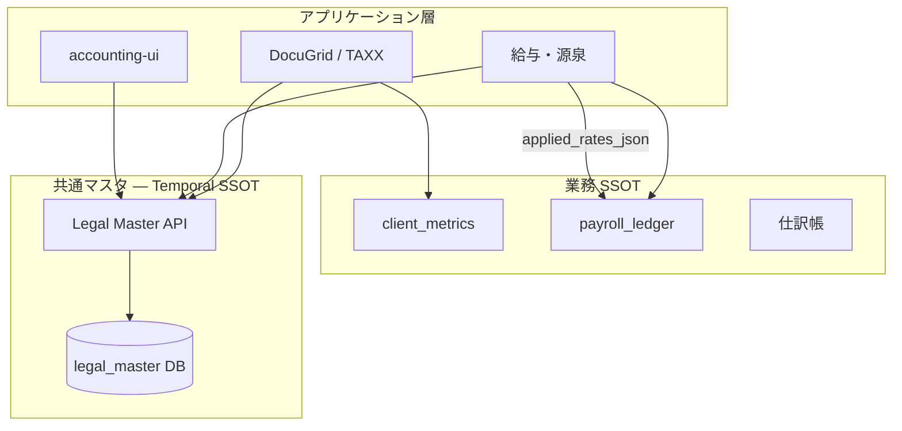

# 完全履歴管理型マスタ（Temporal Master Pattern）

最終更新: 2026-06-19

## 目的

TAXX エコシステム（DocuGrid、給与・税務計算、会計連携を含む）において、**法令・制度で定められた基準値**をアプリケーションソースコードに埋め込まない。改定履歴を保持し、任意の日付時点で正しい値を再現できる **共通マスタサービス** を中核に据える。

本ドキュメントは **開発基本思想** である。実装・レビュー・新機能設計時は本書に従う。

---

## 1. コア原則

### 1.1 ハードコーディング厳禁

以下を **Python / TypeScript の定数・if 分岐・コメント内の「令和○年」固定表** として持ってはならない。

| カテゴリ | 例 |
|----------|-----|
| 消費税 | 標準税率、軽減税率、インボイス経過措置の控除率 |
| 法人税 | 法人税率、地方法人税、中小法人軽減、実効税率 |
| 社会保険 | 健康保険・厚生年金・雇用保険の料率（都道府県・業種別を含む） |
| 標準報酬 | 等級表・標準報酬月額の上下限 |
| 労働 | 地域別最低賃金 |
| 源泉・所得税 | 源泉徴収税額表、累進税率、復興特別所得税率 |
| 控除 | 基礎控除、扶養控除、配偶者控除、社会保険料控除上限 等 |
| 通達・特例 | 賃上げ促進税制の率、届出期限の制度パラメータ |

**許容される例外（本パターンの対象外）**

- UI ラベル・書類種別キーワード（`doc_classifier.py` の分類語）
- デモ用シード比率（`client_metrics` のグラフ見本）
- インフラ設定（レートリミット秒数など業務法令と無関係な値）

### 1.2 共通マスタサービスへの集約

法定基準値は **共通マスタサービス** に集約する。

| 配置案 | 説明 |
|--------|------|
| **別リポジトリ（推奨）** | `legal-master` 等。TAXX・accounting-ui・将来モジュールが同一 API を参照 |
| **TAXX 内独立モジュール** | `backend/legal_master/` + 専用 DB。のちにリポジトリ分割可能な境界で実装 |

会計帳簿（仕訳 SSOT）は **税務会計システム**、**法令パラメータ SSOT は共通マスタ** と責務を分離する（[`ecosystem-accounting-ui-integration.md`](ecosystem-accounting-ui-integration.md)、[`product-naming.md`](product-naming.md)）。

### 1.3 イミュータブルな過去

過去の帳簿・申告書・監査表示を **最新マスタで再計算して上書きしてはならない**。

- 取引・給与・申告の **処理時点** で参照したマスタのスナップショット、または `master_version_id` を業務データに保存する
- 再表示・監査は **当時有効だった料率** で検証可能であること

---

## 2. データベース設計（必須）

### 2.1 有効期間カラム

共通マスタの **すべてのレコード** に以下を付与する。

| カラム | 型 | 説明 |
|--------|-----|------|
| `valid_from` | `DATE` または `TIMESTAMP` | 適用開始日（含む） |
| `valid_to` | `DATE` または `TIMESTAMP` | 適用終了日（含む）。現在有効は `NULL` または sentinel（`9999-12-31`） |

推奨追加カラム:

| カラム | 説明 |
|--------|------|
| `master_key` | 論理キー（例 `consumption_tax.standard_rate`） |
| `jurisdiction` | 都道府県コード・自治体コード（該当時） |
| `attributes` | JSON（軽減税率の対象区分、業種コード等） |
| `source_law` | 根拠法令・通知番号（監査用） |
| `created_at` / `created_by` | マスタ投入の追跡 |

### 2.2 ドメイン別テーブル（たたき台）

```
legal_master_domains
  ├── consumption_tax_rates        # 標準・軽減・経過措置
  ├── corporate_tax_rates          # 法人税・地方法人税
  ├── social_insurance_rates       # 健保・厚年・雇保（都道府県・年度）
  ├── standard_remuneration_grades # 標準報酬月額等級表
  ├── minimum_wages                # 地域別最低賃金
  ├── income_tax_brackets          # 所得税累進税率
  ├── withholding_tax_tables       # 源泉徴収税額表（キー・月額・税額）
  ├── deduction_amounts            # 各種控除額
  └── legal_notices                # 通達・届出期限パラメータ（任意）
```

テーブル分割は実装時に正規化する。重要なのは **すべての行に `valid_from` / `valid_to` があること**。

### 2.3 時点検索クエリ（標準）

```sql
SELECT *
FROM consumption_tax_rates
WHERE master_key = :key
  AND (jurisdiction IS NULL OR jurisdiction = :jurisdiction)
  AND valid_from <= :as_of_date
  AND (valid_to IS NULL OR valid_to >= :as_of_date)
ORDER BY valid_from DESC
LIMIT 1;
```

アプリケーションは生 SQL を散在させず、**マスタサービス API または共有ライブラリ1か所** に集約する。

---

## 3. API・UI 実装ルール

### 3.1 必須パラメータ: `as_of` / `transaction_date`

計算・バリデーション・表示でマスタを参照する API は、必ず基準日を受け取る。

```http
GET /api/v1/legal-master/rates/consumption-tax?as_of=2024-10-01&jurisdiction=13
```

```json
{
  "master_key": "consumption_tax.standard_rate",
  "as_of": "2024-10-01",
  "value": 0.10,
  "valid_from": "2019-10-01",
  "valid_to": null,
  "master_version_id": "ctr-2019-10-01-v1"
}
```

| シナリオ | 渡す日付 |
|----------|----------|
| 仕訳・請求の税計算 | 取引日 `transaction_date` |
| 給与計算 | 支給日 `payment_date` |
| 年末調整 | 課税年度の基準日（例 `YYYY-12-31` または制度定義日） |
| 申告書プレビュー | 事業年度末日 |
| 監査・再表示 | **元処理時に保存した `as_of` または `master_version_id`** |

**禁止:** `GET .../rates/consumption-tax` のように日付なしで「最新だけ返す」API を計算エンジンから呼ぶこと（表示用の「現在の制度一覧」以外）。

### 3.2 業務データへのマスタ参照の保存

給与行・税計算結果・申告ドラフトには、少なくとも以下のいずれかを永続化する。

| 方式 | フィールド例 | 用途 |
|------|--------------|------|
| **スナップショット** | `applied_rates_json` | 再計算不要の監査証跡 |
| **バージョン ID** | `master_version_ids[]` | マスタ DB から当時値を再取得 |
| **両方** | 推奨（障害時の冗長性） | 本番監査 |

`payroll_ledger` の月次行、将来の仕訳税額、年末調整結果に適用する（[`payroll-withholding-year-end-vision.md`](payroll-withholding-year-end-vision.md) §4 拡張）。

### 3.3 フロントエンド

- 計算 UI はバックエンド API に `as_of` を渡す。フロントに税率定数を持たない
- 過去月の給与・源泉画面を開くとき、URL またはデータの `year_month` から `as_of` を導出して API に送る
- 「最新マスタで再シミュレーション」は **別操作** とし、確定データを上書きしない（シミュレーション DB は [`ssot-normalization.md`](ssot-normalization.md) の `client_simulation` と同様の扱い）

---

## 4. エコシステム内の位置づけ



| ストア | 内容 | 時間軸 |
|--------|------|--------|
| **共通マスタ** | 税率・料率・控除額・等級表 | `valid_from` / `valid_to` |
| **業務 SSOT** | 給与行・指標・仕訳 | 事実の発生日・処理日 + 適用マスタのスナップショット |
| **資料 SSOT** | PDF 版・監査 | イミュータブル版管理 |

[`taxx-ecosystem-development-plan.md`](taxx-ecosystem-development-plan.md) §2.6 リーガルテック適合エンジンは、本パターンの **消費側（適用・警告・通達判定）** として実装する。

---

## 5. 開発フェーズ

| Phase | 内容 | 成果物 |
|-------|------|--------|
| **M0** | 本ドキュメント合意・レビュー checklist | PR テンプレに「法定値ハードコードなし」 |
| **M1** ✅ | スキーマ + seed（消費税・所得税累進・基礎控除） | `legal_master.db`、参照 API v1、`/dev/legal-master` |
| **M2** | 社保等級表・料率の移行 | `social_insurance_santei.py` からの脱却 |
| **M3** | 給与・年調エンジン接続 + `applied_rates` 保存 | `year_end_engine.py` からの脱却 |
| **M4** | accounting-ui 共通参照 | handoff 文書更新 |
| **M5** | 通達・届出期限・賃上げ税制 | リーガルテック拡張 |

---

## 6. 現行コードの技術的負債（要移行）

以下は **プロトタイプとして暫定ハードコード** されている。新規の法令値追加は禁止し、M1–M3 でマスタサービスへ移す。

| ファイル | 内容 | 移行先マスタ |
|----------|------|--------------|
| `backend/services/social_insurance_santei.py` | `STANDARD_REMUNERATION_TABLE`（2024年度等級表） | `standard_remuneration_grades` |
| `backend/services/year_end_engine.py` | `BASIC_DEDUCTION_YEN` 等の控除額 | `deduction_amounts` |
| `backend/services/year_end_engine.py` | `income_tax_on_taxable` 累進税率 | `income_tax_brackets` |
| `backend/services/year_end_engine.py` | `RECONSTRUCTION_TAX_RATE` | `income_tax_surcharges` |
| `backend/services/year_end_engine.py` | 社会保険料控除上限 `120_000` | `deduction_amounts` |

関連テストは移行後も **過去日付 fixture** で当時税率の再現性を検証すること。

---

## 7. レビュー・実装チェックリスト

新規 PR で以下を確認する。

- [ ] 新しい税率・料率・控除額がソースコードに直接書かれていない
- [ ] マスタ参照 API に `as_of` / `transaction_date` がある
- [ ] 過去データの再表示が最新マスタで上書きされない
- [ ] 確定処理時に `applied_rates_json` または `master_version_id` を保存する設計がある
- [ ] マスタ seed 変更 PR に `valid_from` / `valid_to` と根拠法令の記載がある
- [ ] [`ssot-normalization.md`](ssot-normalization.md) レジストリを更新した（業務 SSOT とマスタの境界が変わる場合）

---

## 8. 関連ドキュメント

| 文書 | 関係 |
|------|------|
| [`ssot-normalization.md`](ssot-normalization.md) | 業務データの SSOT。マスタは参照専用の別層 |
| [`architecture.md`](architecture.md) | ランタイム全体 |
| [`taxx-ecosystem-development-plan.md`](taxx-ecosystem-development-plan.md) | §2.6 リーガルテック |
| [`payroll-withholding-year-end-vision.md`](payroll-withholding-year-end-vision.md) | 給与・源泉での適用 |
| [`ecosystem-accounting-ui-integration.md`](ecosystem-accounting-ui-integration.md) | 会計モジュールも同一マスタ API を参照 |

---

## 変更履歴

| 日付 | 内容 |
|------|------|
| 2026-06-19 | 初版: 原則・DB・API・イミュータブル・負債一覧・フェーズ |
